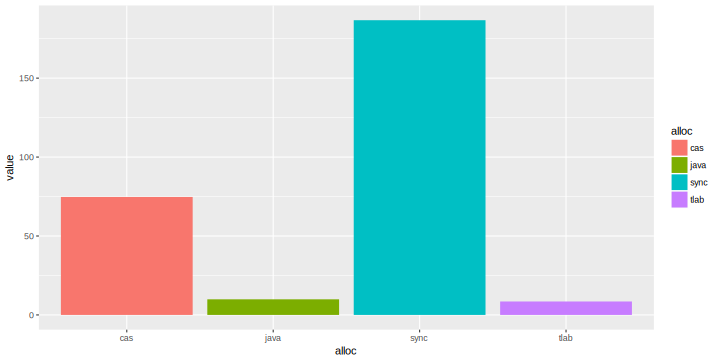
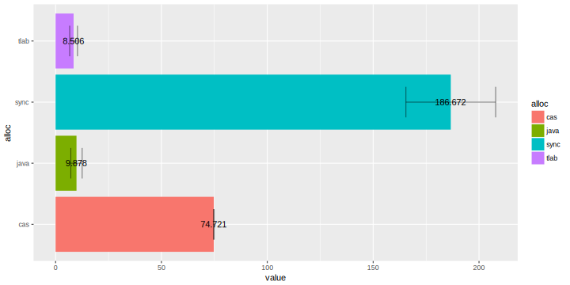
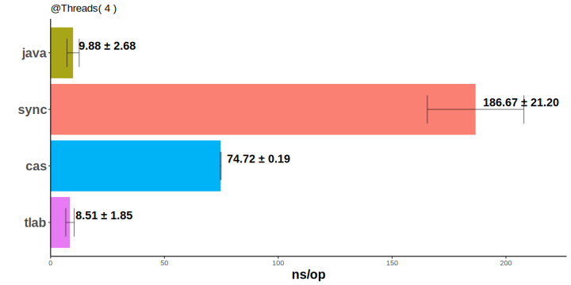
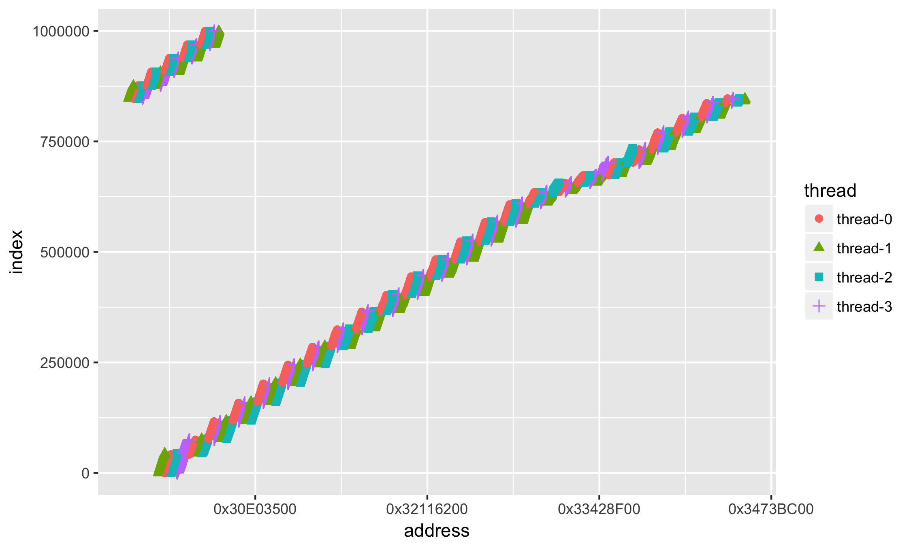

# RMarkdown, R и ggplot

Данная статья **не является** ни документацией, **ни рассказывает** что-то принципиально новое, её стоит рассматривать как обзорную или как *шпаргалку*.

## Преамбула
Конференция это прежде всего доклады, и далеко не последнее место занимает то, как оформлены слайды доклада.

_Безусловно_, есть [докладчики](https://twitter.com/shipilev), которые могут не смотря ни на что, провести доклад даже без единого слайда, но всё же они как правило хорошо дополняют повествование. [Одним](https://twitter.com/jbaruch) достаточно накидать мемасиков в доклад и дело готово, [другим](https://twitter.com/iwan0www) обязательно надо вставить код, причём на ассемблере (кто не в курсе ещё - [JPoint](https://jpoint.ru/) - это конференция по java), и есть ещё те, кому надо показать графики. Впрочем встречается и их комбинация.

Пожалуй известные средства для создания слайдов это:
- PowerPoint, и вариации в лице LibreOffice Impress, Apple KeyNote
- облачные вариации с тем же подходом - [Google Slides](https://www.google.com/slides)
- [LaTeX](https://www.latex-project.org/)
- и относительно новый (для меня) [RMarkdown](http://rmarkdown.rstudio.com/)

И если первые два по своей сути представляют бинарные форматы, а облачные [Google Slides и ко ](https://www.google.com/slides) ещё требуют наличие интернета, что является некоторым неприятным ограничением (во время поездок и перелётов), то последние два - и оффлайновые, и исключительно текстовые, а значит можно хранить историю всех изменений в git/hg/на ваш вкус. Кроме того, область применения далеко не ограничена только слайдами.

**LaTeX** формат с историей - много написано и сказано, а вот RMarkdown молодой, даже немного хипстерский, но без подворотов.

### Markdown
Markdown это облегченный язык разметки, созданный с целью написания максимально читаемого и удобного для правки текста. Markdown является и лёгким для понимания, и легким для чтения даже *без каких-либо трансформаций*.

Сравните сами: ```_курсив_``` это _курсив_, ```**сильное выделение**``` это **сильное выделение**, и многое другое - более подробно описано в [Markdown cheatsheet](https://github.com/adam-p/markdown-here/wiki/Markdown-Cheatsheet).

Markdown поддерживают github, habrahabr, sublime, jira (имеет схожий синтаксис), и многие другие.

### R

[R](https://www.r-project.org/) — язык программирования для статистической обработки данных и работы с графикой.

Как правило это останавливает - это очень сложно, это математика, и это не надо - но никто же заставляет использовать всю доступную функциональность, пожалуй самый простой и наглядный - это графики и визуализация.

> Хотя часто для того, чтобы построить какой-либо график используют Excel, он с большим трудом справляется, когда количество данных приближается уже к миллиону. Тогда как для R это не является какой-то сложной задачей.

#### Данные и графики

> Оставим за кадром баталию, что же лучше - таблицы или графики. Вопрос вкуса.

Для построения графиков используем расширение [ggplot2](http://ggplot2.tidyverse.org/index.html).

Устанавливаем модуль для *R* :
```
install.packages("ggplot2")
```

Но чтобы строить графики нужны данные, и разумно хранить их отдельно от представления, например, в csv формате - опять же - простой текстовый формат.

> Мои данные - это результаты полученные при помощи [jmh](openjdk.java.net/projects/code-tools/jmh) для моего доклада [Внутрь VM сквозь замочную скважину hashCode](https://jpoint.ru/talks/through-the-keyhole-of-hashcode-into-vm/). Мне нравится стиль, используемый Алексеем Шипилёвым: записывать результаты benchmark'а в виде комментария в начале файла - **grep-n-sed** и мы имеем csv-файл.

данные `csv/allocations.csv`:
```csv
pos,alloc,value,error
10,single-threaded,2.836,0.285
20,java,9.878,2.676
28,epsilon,75.289,23.667
30,sync,186.672,21.195
40,cas,74.721,0.192
50,tlab,8.506,1.849
55,javaHashCode,60.270,12.318
57,readHashCode,7.296,0.316
```

Формируем *таблицу данных* (*data frame*) из csv-файла - по-умолчанию, считается, что в файле есть заголовок - это нам поможет при обращении к отдельным колонкам

    ```{r}
    df = read.csv(file = "csv/allocations.csv")
    ```

если хотим отфильтровать, н-р, по конкретным значениям в колонке **alloc**

    df <- subset(df, alloc == "cas" | alloc == "java" | alloc == "sync" | alloc == "tlab" )

### Бары / столбики

Для начала необходимо задать *схему соответствия переменных* (**aes**) из таблицы данных - отображать будем значение от типа, в нашем случае типа аллокации, цвет бара будет выбран также на основе типа аллокации.

    ggplot(data=df, aes(x=alloc, y=value, fill=alloc))

Отображать будем в виде столбиков ( *bar chart* ) **+ geom_bar()**

    ggplot(data=df, aes(x=alloc, y=value, fill=alloc))
    + geom_bar(stat="identity")

результат:


повернём систему координат (из вертикальных в горизонтальные бары) опцией **+ coord_flip()**

    ggplot(data=df, aes(x=alloc, y=value, fill=alloc)) +
    geom_bar(stat="identity") +
    coord_flip()


добавим ошибку изменений **+ geom_errorbar()** (помните, у нас в csv-файле есть колонка **error**):

    ggplot(data=df, aes(x=alloc, y=value, fill=alloc)) +
    geom_bar(stat="identity") +
    coord_flip() +
    geom_errorbar(aes(ymin = value - error, ymax = value + error), width=0.5, alpha=0.5)


для наглядности стоит добавить значения рядом с баром **+ geom_text()** (логично, что текстом будет **value**)

    ggplot(data=df, aes(x=alloc, y=value, fill=alloc)) +
    geom_bar(stat="identity") +
    coord_flip() +
    geom_errorbar(aes(ymin = value - error, ymax = value + error),  width=0.5, alpha=0.5) +
    geom_text(aes(label=value))



добавим лоска подписи **+ geom_text()**:
* используем функцию для изменения подписи _значение ± ошибка_ - **label=base::sprintf("%0.2f ± %0.2f", value, error)** (привет старый добрый _sprintf_ и шаблоный форматирования _%f_!)
* поиграемся с горизонтальным **hjust** и вертикальным **vjust** расположением подписи
* изменим размер шрифта **size** и начертание **fontface** подписи
<br/>

    ggplot(data=df, aes(x=alloc, y=value, fill=alloc)) +
    geom_bar(stat="identity") +
    coord_flip() +
    geom_errorbar(aes(ymin = value - error, ymax = value + error),  width=0.5, alpha=0.5) +
    geom_text(aes(label=base::sprintf("%0.2f ± %0.2f", value, error)), hjust=-0.1, vjust=-0.4, size=5, fontface = "bold")


* подкрутим тему **+ theme_classic()**
* уберём легенду **+ theme(legend.position="none")**
* добавим подписи **+ labs(title = .. , x = .. , y = ..)** и шрифты для осей **+ theme(axis.text.y = ..)**
<br/>

    ggplot(data=df, aes(x=alloc, y=value, fill=alloc)) +
    geom_bar(stat="identity") +
    coord_flip() +
    geom_errorbar(aes(ymin = value - error, ymax = value + error),  width=0.5, alpha=0.5) +
    geom_text(aes(label=base::sprintf("%0.2f ± %0.2f", value, error)), hjust=-0.1, vjust=-0.4, size=5, fontface = "bold") +
    labs(title = "@Threads( 4 )", x = "", y = "ns/op") +
    theme_classic() +
    theme(axis.text.y = element_text(size = 16, face = "bold")) +
    theme(axis.title = element_text(size = 16, face = "bold")) +
    theme(legend.position="none")


и для придания финального лоска
* специфицируем цвета **+ scale_fill_manual()**
* удалим зазор между вертикальной осью и баром **+ scale_y_continuous()** и немного расширим диапазон значений, чтобы и ошибка помещалась, и подпись
* и ещё зафиксируем порядок баров, согласно колонке **pos**: **x=reorder(alloc, -pos)**

<br/>

    ggplot(data=df, aes(x=reorder(alloc, -pos), y=value, fill=alloc)) +
    geom_bar(stat="identity") +
    coord_flip() +
    geom_errorbar(aes(ymin = value - error, ymax = value + error),  width=0.5, alpha=0.5) +
    geom_text(aes(label=base::sprintf("%0.2f ± %0.2f", value, error)), hjust=-0.1, vjust=-0.4, size=5, fontface = "bold") +
    scale_fill_manual(values=c(java'='#a9a518','sync'='#fa8074', 'cas'='#00b3f6', 'tlab'='#e67bf3')) +
    labs(title = "@Threads( 4 )", x = "", y = "ns/op") +
    theme_classic() +
    scale_y_continuous(limits=c(0, max(df$value) + 40), expand = c(0, 0)) +
    theme(axis.text.y = element_text(size = 16, face = "bold")) +
    theme(axis.title = element_text(size = 16, face = "bold")) +
    theme(legend.position="none")




_tip_: можно сохранить график в файл **+ ggsave("allocations.svg")**, но не стоит злоупотреблять векторным форматом, если на графике много точек - сохраняйте в растр, н-р **png**.

```
install.packages("svglite")
```

> Отдельно стоит отметить цветовую палитру, используемую по-умолчанию: выбираемые цвета хорошо различимы даже для людей с ослабленым цветовосприятием.

> Не используйте сочетание красный/зелёный даже если вы используете всего два цвета, чтобы выделить, что лучше/хуже - эти цвета слабо различимы для людей с ослабленым цветовосприятием.

_tip_: [colorbrewer2](http://colorbrewer2.org/#type=diverging&scheme=RdBu&n=6) поможет выбрать в т.ч. *безопасные* цвета.

#### Точки

Есть некоторое распределение адресов по нитям
```
step,thread,address
1,thread-0,807437816
1,thread-1,807437784
1,thread-2,807437800
..........
```

* отобразим отдельно по точкам **+ geom_point**
 * чтобы можно было различить одну нить от другой, укажем не только цветовую **aes(..., colour = thread,...)** дифференциацию, но и на основе [_формы_ маркера](http://www.cookbook-r.com/Graphs/Shapes_and_line_types/) **aes(..., shape = thread,...)** -
<br/>

    ggplot(data=df, aes(x = address, y = index, group=thread, colour=thread, shape=thread)) +
    geom_point(size=2)


Первое, что бросается в глаза (кроме того, что много данных) - это значения адресов в научной нотации. Как-то привычней иметь дело с адресами в 16-тиричной системе: добавим форматирование значений по оси X **+scale_x_continuous()**:

    ggplot(data=df, aes(x = address, y = index, group=thread, colour=thread, shape=thread)) +
    geom_point(size=2) +
    scale_x_continuous(
        labels = function(n){base::sprintf("0x%X", as.integer(n))}
    )



Лучше, но всё равно как-то сложно и мало понятно.

Поскольку мы можем задавать любую функцию, то почему бы не отображать смещение относительно некоторого базового, н-р минимального, адреса:

    min_address = min(df$address)

    ggplot(data=df, aes(x = address, y = index, group=thread, colour=thread, shape=thread)) +
    geom_point(size=2) +
    scale_x_continuous(
        labels = function(n){base::sprintf("+ %d MiB", as.integer((n - min_address)/1024/1024))}
    )


Опять же в силу привычки - поставим метки (**breaks =**) по *целым* числам - а именно 16, 32, 48, 64Мб:

    ggplot(data=df, aes(x = address, y = index, group=thread, colour=thread, shape=thread)) +
    geom_point(size=2) +
    scale_x_continuous(
        labels = function(n){ifelse(n == min_address,  base::sprintf("base"), base::sprintf("+ %d MiB", as.integer((n - min_address)/1024/1024)))},
        breaks=c(min_address, min_address + 16*1024*1024, min_address +  32*1024*1024,  min_address + 48*1024*1024,  min_address + 64*1024*1024)
    )


Данных много - хотим взглянуть на небольшую её часть

* ограничим набор данных по количеству **nrows** при загрузке **read.csv(...)**
* добавим метки в нужных местах на оси **Y**: **+ scale_y_continuous(breaks = c(...))**
<br/>

    df = read.csv(file = "csv/hashCodesNoTLAB.csv", nrows = 36, header = TRUE)

    min_address = min(df$address)

    ggplot(data=df, aes(x = address, y = index, group=thread, colour=thread, shape=thread)) +
    geom_point(size=4) +
    scale_x_continuous(
        labels = function(n){ifelse(n == min_address,  base::sprintf("base"), base::sprintf("+ %d", as.integer((n - min_address))))},
        breaks=c(min_address, min_address + 16*10, min_address +  2*16*10,  min_address + 3*16*10, min_address + 4*16*10, min_address + 5*16*10)
    ) +
    scale_y_continuous( breaks = c(1,2,3,4,5,6,7,8,9,10) ) +


#### Гистограмма

И конечно же - [гистограмма](https://ru.wikipedia.org/wiki/Гистограмма), частотное распределение. Очень грубо это можно описать как количество элементов попадающих в диапазон значений. Н-р, для ряда [1, 2, 3, 1, 1] - гистограмма будет выглядеть как [3, 1, 1] - т.к элемент *1* встретился 3 раза, а элементы *2* и *3* по одному разу.

    addressHashCode = read.csv(file = "csv/addressHashCode.csv")
    defaultHashCode = read.csv(file = "csv/defaultHashCode.csv")

    ggplot() +
    geom_histogram(data=addressHashCode, aes(x=hashCode, fill="address"), alpha=0.7, bins = 500) +
    geom_histogram(data=defaultHashCode, aes(x=hashCode, fill="MXSRng"), alpha=0.7, bins = 500) +


Добавляем уже известные опции до придания нужного вида:

    ggplot() +
    geom_histogram(data=addressHashCode, aes(x=hashCode, fill="address"), alpha=0.7, bins = 500) +
    geom_histogram(data=defaultHashCode, aes(x=hashCode, fill="MXSRng"), alpha=0.7, bins = 500) +
    scale_fill_manual(name="тип hashCode:", labels=c("address"="адрес", "MXSRng"="MXS-гпсч"), values=c("address" ="#003dae", "MXSRng" = "#ae003d")) +
    labs(title =
         sprintf("количество коллизий по адресу: %s k, по MXS-гпсч: %s k",
                 round( sum(duplicated(addressHashCode)) / 1000, 1),
                 round( sum(duplicated(defaultHashCode)) / 1000, 1)),
       x = "hashCode") +
    theme_classic() +
    theme(axis.title.y=element_blank()) +
    scale_y_continuous(labels = function(n){format(n, big.mark = "_", scientific = FALSE)}, expand = c(0, 0)) +
    scale_x_continuous(labels = function(n){format(n, big.mark = "_", scientific = FALSE)}, expand = c(0, 0)) +
    theme(axis.title = element_text(size = 16, face = "bold")) +
    theme(axis.text.y = element_text(size = 14, face = "bold")) +
    theme(axis.text.x = element_text(size = 14, face = "bold")) +
    theme(axis.title = element_text(size = 16, face = "bold")) +
    theme(axis.title.x=element_text(margin=margin(t=20))) +
    theme(legend.text = element_text(size = 14, face = "bold")) +
    theme(title = element_text(size = 16, face = "bold")) +


[А пони](https://twitter.com/shipilev/status/857311629847015425) ? Запросто!

* нужен пакет **png** : ```install.packages('png')```
* **img <- readPNG("images/pony.png")**
* *отрендерим* во внутренний буфер **g <- rasterGrob(img)**
* добавим пони как аннотацию **+ annotation_custom()**:

```
# install.packages('png')

img <- readPNG("images/pony.png")
g <- rasterGrob(img, interpolate=TRUE, x = 0.1, y = 0.9, width = 0.2, height = 0.2)

  ggplot() +
  annotation_custom(g, xmin=-Inf, ymin = -Inf, xmax=Inf, ymax=Inf) +
  geom_histogram(data=addressHashCode, aes(x=hashCode, fill="address"), alpha=0.7, bins = 500) +
  geom_histogram(data=defaultHashCode, aes(x=hashCode, fill="MXSRng"), alpha=0.7, bins = 500)

```


Немного полезных ссылок: [ggplot2 tutorial](https://github.com/jennybc/ggplot2-tutorial) и ещё один полезный блог [Data wrangling, exploration, and analysis with R](http://stat545.com/topics.html)

### RMarkdown

Не надо быть большим капитаном, чтобы сообразить, что **[RMarkdown](http://rmarkdown.rstudio.com/)** это **R** + **Markdown**.

Устанавливаем модуль для *R* :

```
install.packages("rmarkdown")
```

И со словами **HTML знаю, LaTeX люблю** рендерим **RMarkdown**:

> rmarkdown::render("path_to_file.Rmd", encoding = "UTF-8")

* возможен вывод в следующие форматы :
    * **[html](http://rmarkdown.rstudio.com/html_document_format.html)**
    * **[pdf](http://rmarkdown.rstudio.com/pdf_document_format.html)**
    * и даже в **[doc](http://rmarkdown.rstudio.com/word_document_format.html)**

В заголовке досаточно указать, например:
> output: pdf_document

* слайды/презентация:
    * **[HTML5](http://rmarkdown.rstudio.com/ioslides_presentation_format.html)** и упарываться **javascript** / **css** / **html5**, хотя далеко не все одобряют *html*-презентации
    * **[PDF](http://rmarkdown.rstudio.com/beamer_presentation_format.html)** и использовать в т.ч. макросы **LaTeX**

для этого в заголовке достаточно поменять **output**:
> output: ioslides_presentation
