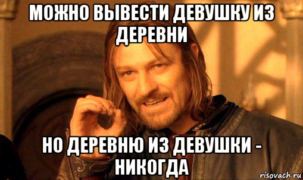

<div class="footer"></div>
```{r setup, include=FALSE}
library(gdata)
library(ggplot2)

Sys.setlocale(category = "LC_ALL", locale = 'UTF-8')

knitr::opts_chunk$set(echo = FALSE)
```
## План

* Капитанство: немного теории
* HashCode как утекшая абстракция
* JVM потроха и Unsafe
* Немного баттлов про hashCode - RuntimeException vs OOM
    + GC
    + Аллокации
* Правила вычисления hashCode
* DoS-атака с примененимем hashCode
* Удешевление блокировок

## Телефонная книга
<embed src="images/pair.svg" type="image/svg+xml" />

## Записать ( jbaruch, +1... )

<embed src="images/list-pair1.svg" type="image/svg+xml" />

## Записать ( shipilёv, +420... )

<embed src="images/list-pair2.svg" type="image/svg+xml" />

## Записать ( 23derevo, +7916... )

<embed src="images/list-pair3.svg" type="image/svg+xml" />

## Найти 23derevo

<embed src="images/list-pair3-get0.svg" type="image/svg+xml" />

## Найти 23derevo

<embed src="images/list-pair3-get1.svg" type="image/svg+xml" />

## Найти 23derevo

<embed src="images/list-pair3-get2.svg" type="image/svg+xml" />

## Найти
```java
String key = "23derevo";

for ( int index = 0; i < array.length; i++ ) {

    if ( keys[index].equals( key ) )
        return values[index];

}

return null;
```

сложность → **O(N)**

# Можно ли лучше ?

## Hash!

<embed src="images/hash.svg" type="image/svg+xml" />

`f = hashCode` , тогда

`index = key.hashCode() % keys.length`

## javadoc:
### java.lang.Object

`public int hashCode()`

Returns a hash code value for the object. This method is
supported for the benefit of hash tables such as those
provided by **HashMap**.

[https://docs.oracle.com/javase/8/docs/api/java/lang/Object.html](https://docs.oracle.com/javase/8/docs/api/java/lang/Object.html#hashCode--)

## Записать ( jbaruch, +1... )

<embed src="images/hashtable-put.svg" type="image/svg+xml" />

## Записать ( shipilёv, +420... )

<embed src="images/hashtable-put2.svg" type="image/svg+xml" />

## Записать ( 23derevo, +7916... )

<embed src="images/hashtable-put3.svg" type="image/svg+xml" />

## Найти 23derevo

<embed src="images/hashtable-get.svg" type="image/svg+xml" />

## Найти Медведа

<embed src="images/hashtable-get-null.svg" type="image/svg+xml" />

## Сложность поиска / вставки

```java
String key = "23derevo";

int index = key.hashCode() % keys.length;

if ( key.equals( keys[index] ) ) {
    return values[index];
}

return null;
```
сложность → **O(1)**

## неспокойный jbaruch

<embed src="images/hashtable-broken.svg" type="image/svg+xml" />

## Контракт hashCode

- неизменчивость и постоянство

Whenever it is invoked on the same object more than once during
an execution of a Java application, the hashCode method **must**
**_consistently_** return the **same integer**, provided no information
used in equals comparisons on the object is modified.


[https://docs.oracle.com/javase/8/docs/api/java/lang/Object.html](https://docs.oracle.com/javase/8/docs/api/java/lang/Object.html#hashCode--)

## Разбор Полетов !

<embed src="images/hashtable-collisions.svg" type="image/svg+xml" />

# Будет ли драка ?

## Драки не будет - но будет снова список

<embed src="images/hashtable-collisions-chaining.svg" type="image/svg+xml" />

# Object.hashCode - утёкшая абстракция

## Urban Legend: Первоисточник
### java.lang.Object

`public int hashCode()`

This is typically implemented by converting the **internal address of the object** into an integer.

[https://docs.oracle.com/javase/8/docs/api/java/lang/Object.html](https://docs.oracle.com/javase/8/docs/api/java/lang/Object.html#hashCode--)


## Urban Legend:

```java
package java.lang;

public class Object {

    // ...

    public int hashCode(){
      return &this;
    }

}
```

#      &nbsp;
<div>
<center>

</center>
</div>

## sun.misc.Unsafe {.unsafe}

```java
static Unsafe UNSAFE = ... ; // Reflection Magic

static long addressOf(Object, int oopSize) throws Exception {
    Object[] array = new Object[] {o};
    long baseOffset = unsafe.arrayBaseOffset(Object[].class);
    switch (oopSize) {
        // 32bit или ( -XX:+UseCompressedOops и heap < 4Gb )
        case 4:
            return (((long)unsafe.getInt(array, baseOffset)) & 0xFFFFFFFFL) << 3;
        // 64bit и ( -XX:-UseCompressedOops или heap > 4Gb )
        case 8:
            return unsafe.getLong(array, baseOffset);
        default:
            throw new Error("unsupported address size: " + addressSize);
    }
}
```

## Правильный ответ - Java Object Layout

```java

VirtualMachine vm = VM.current();

long address = vm.addressOf(object);

```

## Адресное пространство объекта

```java
    switch (oopSize) {
        // 32bit или ( -XX:+UseCompressedOops и heap < 4Gb )
        case 4:
            return (((long)unsafe.getInt(array, baseOffset))
              & 0xFFFFFFFFL) << 3;
    }
```
<embed src="images/address.svg" type="image/svg+xml" />

## Переезд Баруха: OOM vs RuntimeException

```java
final Object БАРУХ = new Object();
final long адресБаруха = getAddress(БАРУХ);

List туса = new ArrayList();
туса.add(барух);

while (true) {
    Object чувак = new Object();

    туса.add(чувак);

    long инойАдресБаруха = getAddress(БАРУХ);

    if (адресБаруха != инойАдресБаруха)
    	  throw new RuntimeException();
}
```
```-Xms256m -Xmx256m -XX:+UseSerialGC```

## Переезд Баруха и Тов. Мусорщик

```java
final Object БАРУХ = new Object();
final long адресБаруха = getAddress(БАРУХ);

List туса = new ArrayList();
туса.add(БАРУХ);

while (true) {
    Object чувак = new Object();

    туса.add(чувак);

    long инойАдресБаруха = getAddress(БАРУХ);

    if (адресБаруха != инойАдресБаруха)
    	  throw new RuntimeException();
}
```

`-verbose:gc -XX:+PrintGC -XX:+PrintGCDetails`

## Переезд Баруха и Тов. Мусорщик

<embed src="images/reallocation2.svg" type="image/svg+xml" />

## Смена hashCode Барухом: OOM vs RuntimeException
```java
final Object БАРУХ = new Object();
final int hashCodeБаруха = БАРУХ.hashCode();

List туса = new ArrayList();
туса.add(БАРУХ);

while (true) {
  	Object чувак = new Object();

  	туса.add(чувак);

  	int инойHashCodeБаруха = БАРУХ.hashCode();

  	if (hashCodeБаруха != инойHashCodeБаруха)
  	    throw new RuntimeException();
}
```
```-Xms256m -Xmx256m -XX:+UseSerialGC```

#      &nbsp;

<div>
<center>

</center>
</div>

## О, где же ты, брат ?
```java
package java.lang;

public class Object {

    // ............

    public native int hashCode();

}
```

#      &nbsp;

<div>
<center>

</center>
</div>

## Дамп объекта

<embed src="images/header-address.svg" type="image/svg+xml" />

Intel X86: Little Endian

## Навалим в кучу

```-Xms256m -Xmx256m```

```java
long freeMemory = Runtime.getRuntime().freeMemory();

239_942_568

freeMemory / vm.sizeOf( new Object() ) = 14_996_410
```

→ должно хватить как минимум на ~ **15 млн** объектов

## Молодое поколение

<embed src="images/obj-count.svg" type="image/svg+xml" />

`vm.sizeOf( new Object() ) = 16`

`65536K / 16 = 4_194_304`

## Драка за hashCode: OOM vs RuntimeException

```java
final List туса = new ArrayList();
final TIntSet уникальныеКоды = new TIntHashSet();

while (true) {
	final Object чувак = new Object();
	туса.add(чувак);

	int hashCode = чувак.hashCode();

	if (!уникальныеКоды.add(hashCode))
		throw new RuntimeException();
}
```

```-Xms256m -Xmx256m -XX:+UseSerialGC```


## пространство hashCode

<embed src="images/address2.svg" type="image/svg+xml" />

`22 bit = 4_194_304` уникальных значений

## Упрощённый memory allocation

```java
public interface Allocator {
    long malloc(long size);
}

public class SimpleAllocator implements Allocator {
    private long memoryPointer;

    @Override
    public long malloc(long size) {
        long old = memoryPointer;
        memoryPointer += size;
        return old;
    }
}
```

## Исправим malloc - SyncAllocator

```java
public class SyncAllocator implements Allocator {
    private long memoryPointer;

    @Override
    public synchronized long malloc(long size) {
        long old = memoryPointer;
        memoryPointer += size;
        return old;
    }
}
```

## SyncAllocator Performance Benchmark
```java
    @Benchmark
    public long syncAllocator() {
        return syncAllocator.malloc( 16 );
    }

```

```{r, fig.width=10,fig.height=3}
df = read.csv(file = "csv/allocations.csv", header = TRUE)
df <- subset(df, alloc == "single-threaded" | alloc == 'sync')

ggplot(data=df, aes(x=reorder(alloc, -pos), y=value, fill=alloc)) +
  geom_bar(stat="identity",  colour="#444444", alpha=0.95) +
  scale_fill_manual(values=c('single-threaded'='#2fc2c6','tlab'='#84b128', 'cas'='#c987fc', 'sync'='#f57670')) +
  geom_text(aes(label=value), hjust=-0.05, size=5, fontface = "bold") +
  coord_flip() +
  labs(title = "sync @ (Threads = 10), single-threaded @ (Threads = 1)",
       x = "",
       y = "ns/op") +
  theme_classic() +
  scale_y_continuous(limits=c(0, max(df$value) + 50), expand = c(0, 0)) +
  theme(axis.text.y = element_text(size = 16, face = "bold")) +
  theme(axis.title = element_text(size = 16, face = "bold")) +
  theme(legend.position="none")
```
<embed src="images/less-is-more.svg" type="image/svg+xml" />

# Можно ли лучше ?

## CAS Allocator
```java
public class CASAllocator implements Allocator {
    private final AtomicLong memoryPointer = new AtomicLong();

    @Override
    public long malloc(long size) {
        return memoryPointer.getAndAdd( size );
    }
}
```

## Allocators Performance Benchmark
```java
@Benchmark
public long casAllocator() {
    return casAllocator.malloc( 16 );
}
```


```{r, fig.width=10,fig.height=3}
df = read.csv(file = "csv/allocations.csv", header = TRUE)
df <- subset(df, alloc == "cas" | alloc == 'sync' | alloc == "single-threaded" )

ggplot(alpha=0.3, data=df, aes(x=reorder(alloc, -pos), y=value, fill=alloc)) +
  geom_bar(stat="identity",  colour="#444444", alpha=0.95) +
  scale_fill_manual(values=c('single-threaded'='#2fc2c6','tlab'='#84b128', 'cas'='#c987fc', 'sync'='#f57670')) +
  geom_text(aes(label=value), hjust=-0.2, size=5, fontface = "bold") +
  coord_flip() +
  labs(title = "Threads = 10",
       x = "",
       y = "ns/op") +
  theme_classic() +
  scale_y_continuous(limits=c(0, max(df$value) + 50), expand = c(0, 0)) +
  theme(axis.text.y = element_text(size = 16, face = "bold")) +
  theme(axis.title = element_text(size = 16, face = "bold")) +
  theme(legend.position="none")
```
<embed src="images/less-is-more.svg" type="image/svg+xml" />

# Можно ли ещё лучше ?

## До первой крови

```java
final TIntSet уникальныеКоды = new TIntHashSet(2_000_000);
final int[] hashCodesНагнетателей = new int[threads];
final Phaser этапщик = new Phaser(threads);
final AtomicBoolean драка = new AtomicBoolean(false);

IntStream.range(0, threads).forEach(t -> { new Thread(() -> {
    while (!драка.get()) {
      этапщик.arriveAndAwaitAdvance();
      
      synchronized (уникальныеКоды) {
          final Object чувак = new Object();
          туса.add(чувак);
          hashCodesНагнетателей[t] = чувак.hashCode();
          драка.compareAndSet(false, !уникальныеКоды.add(чувак.hashCode()));
      }
    }
}).start();});
```
```-Xms256m -Xmx256m -XX:+UseSerialGC```

## Распределение hashCode по нагнетателям

размер тусы: 1_566_762

разница Нагнетатель-0 - Нагнетатель-3 : <span class="huge">718_720</span>

разница Нагнетатель-1 - Нагнетатель-0 : <span class="huge">737_824</span>

разница Нагнетатель-2 - Нагнетатель-1 : <span class="huge">786_280</span>

## Даёшь **БОЛЬШИЕ** куски памяти ! {.tlabcode}
```java
public class TLABLikeAllocator implements Allocator {
    private static final long SIZE = 1024L * 1024L;
    
    private final AtomicLong memoryPointer = new AtomicLong();
    private final ThreadLocal<AddressHolder> threadLocal =
         ThreadLocal.withInitial(() -> new AddressHolder());

    public long malloc(long size) {
        AddressHolder addressHolder = threadLocal.get();
        while(true) {
            if (addressHolder.value + size < addressHolder.maxValue)
                return addressHolder.value += size;

            long value = memoryPointer.getAndAdd( SIZE );
            addressHolder.value = value;
            addressHolder.maxValue = value + ( SIZE );
        }
    }
}
```

## Allocators Performance Benchmark
```java
@Benchmark
public long tlabAllocator() {
    return tlabAllocator.malloc( 16 );
}
```

```{r, fig.width=10,fig.height=3}

df = read.csv(file = "csv/allocations.csv", header = TRUE)

ggplot(alpha=0.3, data=df, aes(x=reorder(alloc, -pos), y=value, fill=alloc)) +
  geom_bar(stat = "identity", colour="#444444", alpha=0.95) +
  geom_text(aes(label=value), hjust=-0.2, size=5, fontface = "bold") +
  scale_fill_manual(values=c('single-threaded'='#2fc2c6','tlab'='#84b128', 'cas'='#c987fc', 'sync'='#f57670')) +
  coord_flip() +
  labs(title = "Threads = 10",
       x = "",
       y = "ns/op") +
  theme_classic() +
  scale_y_continuous(limits=c(0, max(df$value) + 50), expand = c(0, 0)) +
  theme(axis.text.y = element_text(size = 16, face = "bold")) +
  theme(axis.title = element_text(size = 16, face = "bold")) +
  theme(legend.position="none")
```
<embed src="images/less-is-more.svg" type="image/svg+xml" />

## Thread Local Allocation Buffer

<embed src="images/tlab.svg" type="image/svg+xml" />

## Thread Local Allocation Buffer

<embed src="images/tlab2.svg" type="image/svg+xml" />

## TLAB и GC

<embed src="images/tlab3.svg" type="image/svg+xml" />

## И снова TLAB

<embed src="images/tlab4.svg" type="image/svg+xml" />


## До первой крови БЕЗ TLAB

```java
final TIntSet уникальныеКоды = new TIntHashSet(2_000_000);
final int[] hashCodesНагнетателей = new int[threads];
final Phaser этапщик = new Phaser(threads);
final AtomicBoolean драка = new AtomicBoolean(false);

IntStream.range(0, threads).forEach(t -> { new Thread(() -> {
    while (!драка.get()) {
      этапщик.arriveAndAwaitAdvance();
      
      synchronized (уникальныеКоды) {
          final Object чувак = new Object();
          туса.add(чувак);
          hashCodesНагнетателей[t] = чувак.hashCode();
          драка.compareAndSet(false, !уникальныеКоды.add(чувак.hashCode()));
      }
    }
}).start();});
```

```-XX:-UseTLAB -Xms256m -Xmx256m -XX:+UseSerialGC```

## Распределение hashCode по нагнетателям БЕЗ TLAB

размер тусы: 1,650,138

разница Нагнетатель-1 - Нагнетатель-2 : <span class="huge">16</span>

разница Нагнетатель-3 - Нагнетатель-1 : <span class="huge">16</span>

разница Нагнетатель-0 - Нагнетатель-3 : <span class="huge">16</span>

## Стоимость TLAB

```java
@Benchmark
public Object allocate() {
   return new Object();
}
```

## Стоимость TLAB

```java
@Benchmark
public Object allocate() {
   return new Object();
}
```

```{r, fig.width=10,fig.height=3}
df = read.csv(file = "csv/UseTLAB.csv", header = TRUE)
ggplot(alpha=0.3, data=df, aes(x=type, y=value, fill=type)) +
  geom_bar(stat="identity",  colour="black") +
  scale_fill_manual(values=c("-XX:-UseTLAB"='#f57670', "-XX:+UseTLAB"="#1fbec3")) +
  geom_text(aes(label=value), hjust=-0.2, size=5, fontface = "bold") +
  coord_flip() +
  labs(title = "Threads = 10",
       x = "",
       y = "ns/op") +
  scale_y_continuous(limits = c(0, max(df$value) + 200), expand = c(0, 0)) +
  theme_classic() +
  theme(axis.text.y = element_text(size = 16, face = "bold")) +
  theme(axis.title = element_text(size=16, face = "bold"))+
  theme(legend.position="none")
```
<embed src="images/less-is-more.svg" type="image/svg+xml" />

## Распределение адресов

`-XX:+UseTLAB`


разница Нагнетатель-0 - Нагнетатель-3 : <span class="huge">718_720</span>

разница Нагнетатель-1 - Нагнетатель-0 : <span class="huge">737_824</span>

разница Нагнетатель-2 - Нагнетатель-1 : <span class="huge">786_280</span>

```
```

⟹ 17 bit / нить

# Может быть Random ?

## Парадокс дней рождений

$$p_{uniq}(n) = \left({1 - \frac{1}{d}}\right)\cdot\left({1 - \frac{2}{d}}\right)\cdot\ldots\cdot\left({1 - \frac{n - 1}{d}}\right) = \frac{d}{d^{n} \cdot (d - n)!}$$


$$ n \approx \sqrt{2  d \cdot ln({1\over{1 - p_{uniq}}}) }$$
$$ при\ d = 2^{32}, \ p = 0.5 \Rightarrow n \approx 77162 $$
<a href="https://www.wolframalpha.com/input/?i=100+-+100+*+(+(2%5E32)!+%2F+(2%5E(32*77170)+*+(2%5E32-77170)!))">Wolfram Alpha и 2<sup>32</sup>!</a>

## -XX:hashCode

-XX:hashCode=k | Тип
---------------|----------
  0 | <span class="good">[Park-Miller ГПСЧ](https://en.wikipedia.org/wiki/Lehmer_random_number_generator) </span>
  1 | <span class="bad">fn(адрес объекта, глобальное состояние)</span>
  2 | <span class="bad">константа 1</span>
  3 | <span class="good">последовательный счетчик</span>
  4 | <span class="bad">адрес объекта</span>
  5 | <span class="good">[Marsagliа xor-shift ГПСЧ](https://en.wikipedia.org/wiki/Xorshift)</span> _**по умолчанию** в java 8_

## Дамп объекта при -XX:hashCode=5

<embed src="images/header.svg" type="image/svg+xml" />

## Распределение 10 млн объектов в 10 нитях
```{r  fig.width=10, fig.height=5, echo = FALSE}

#rows = 1000
rows = 10000000

addressHashCode = read.csv(file = "csv/addressHashCode.csv", nrows = rows, header = TRUE)
defaultHashCode = read.csv(file = "csv/defaultHashCode.csv", nrows = rows, header = TRUE)
ggplot(alpha=0.75) +
  geom_histogram(data=addressHashCode, aes(x=hashCode, fill="address"), alpha=0.5, bins = 800) +
  geom_histogram(data=defaultHashCode, aes(x=hashCode, fill="MXSRng"), alpha=0.5, bins = 800) +
  scale_fill_manual(name="тип hashCode:", labels=c("address"="адрес", "MXSRng"="MXS-гпсч"), values=c("address" = "#f57670", "MXSRng"="#1fbec3")) +
  labs(title =
         sprintf("количество коллизий по адресу: %s k, по MXS-гпсч: %s k",
                 round( sum(duplicated(addressHashCode)) / 1000, 1),
                 round( sum(duplicated(defaultHashCode)) / 1000, 1)),
       x = "hashCode") +
  theme_classic() +
  theme(axis.title.y=element_blank()) +
  scale_y_continuous(labels = function(n){format(n, big.mark = "_", scientific = FALSE)}, expand = c(0, 0)) +
  scale_x_continuous(labels = function(n){format(n, big.mark = "_", scientific = FALSE)}, expand = c(0, 0)) +
  theme(axis.title = element_text(size = 16, face = "bold")) +
  theme(axis.text.y = element_text(size = 14, face = "bold")) +
  theme(axis.text.x = element_text(size = 14, face = "bold")) +
  theme(axis.title = element_text(size = 16, face = "bold")) +
  theme(axis.title.x=element_text(margin=margin(t=20))) +
  theme(legend.text = element_text(size = 14, face = "bold")) +
  theme(title = element_text(size = 16, face = "bold")) +

  theme(aspect.ratio = 9/16)
```

# Beyond the legend

## hashCode() и данные

```java
String name1 = new String("jbaruch");

String name2 = new String("jbaruch");

assert s1.hashCode() == s2.hashCode();

Integer i1 = new Integer(42);

Integer i2 = new Integer(42);

assert i1.hashCode() == i2.hashCode();
```


## Простой hashCode

```java
public class Point {
    public int x, y;

    @Override
    public int hashCode(){
        return 31 * x + y;
    }

    @Override
    public boolean equals(Object o) {
        if (this == o) return true;
        if (!(o instanceof Point)) return false;

        Point point = (Point) o;

        return x == point.x && y == point.y;
    }
}
```

## Objects.hash

```java
@Override
public int hashCode(){
    return Objects.hash(x, y);
}
```

## Полиномиальный hashCode

$$ hashCode = \sum_{k=0}^{n} {31^{n-k} \cdot c_k}  $$

```java
public final class String {
    private final char value[];

    public int hashCode() {
        int h = 0;
        for (int i = 0; i < value.length; i++) {
            h = 31 * h + value[i];
        }
        return h;
    }
}
```

## Почему 31 ?

* Donald Knuth, _The Art of Computer Programming, Volume 3: Sorting and Searching_
* K&R _The C Programming Language, 2 Ed._
* Josh Bloch, [java bug #4045622](http://bugs.java.com/bugdatabase/view_bug.do?bug_id=4045622) - 1997 год (!!!)
    + Все слова и словоформы в словаре Merriam-Webster 2 ред. (311_141 строк, ср. длина 10 символов).
    + Все строки в `/bin/*`, `/usr/bin/*`, `/usr/lib/*`, `/usr/ucb/*` и `/usr/openwin/bin/*`  (66_304 строк, ср. длина 21 символов).
    + Список URL, собранных web-пауком за несколько часов (28_372 строк, ср. длина 49 символов).


## Но ведь можно подобрать...

```java
    assert "Aa".hashCode() == "BB".hashCode();
```

```
```

$$ 31 \cdot c_0 + c_1 = $$
$$ = 31 \cdot (c_0 - 1) + (c_1 + 31) $$

```
```
<div style="text-align: center;">**`username`** ⟹ 499_331 вариантов</div>

## "username" коллизии :: benchmark

```java
    @Benchmark
    public Map fillMap() {
        for (String key : keys) 
            map.put(key, key);
        
        return map;
    }

    @Param( {"1", "1000", "10000", "100000", "150000", "200000"})
    int size;
    String[] keys;
    
    Map map = new HashMap();
```

[CVE-2012-2739 java: hash table collisions CPU usage DoS](https://bugzilla.redhat.com/show_bug.cgi?id=750533)

## "username" коллизии

```{r, fig.width=10,fig.height=5}
df = read.csv(file = "csv/username.csv", header = TRUE)
df7 <- subset(df, java == "java 7")

d <- transform(df7, time_per_op = time / size, time_sec = time / (10^9))

ggplot(data=d, aes(x=size, y=time_sec, group=java, colour=java)) +
  geom_line(linetype="solid", size=2) +
  geom_point(aes(shape=java),size=6) +
  scale_color_manual(values=c("java 8"="#1fbec3", "java 7"="#f57670")) +
  scale_shape_manual(values=c("java 8"=17, "java 7"=19))+
  scale_y_continuous(labels = function(n){format(n, big.mark = "_", scientific = FALSE)}) +
  scale_x_continuous(labels = function(n){format(n, big.mark = "_", scientific = FALSE)}) +
  labs(title = "секунды",
     x = "количество ключей",
     y = "") +
  theme_classic() +
  theme(axis.text.y = element_text(size = 14, face = "bold")) +
  theme(axis.text.x = element_text(size = 14, face = "bold")) +
  theme(axis.title = element_text(size = 16, face = "bold")) +
  theme(axis.title.x=element_text(margin=margin(t=20))) +
  theme(title = element_text(size = 18, face = "bold")) +
  theme(legend.position="none", aspect.ratio = 1/1)
```


# 23derevo
<div style="text-align: right;">

</div>

## Бинарное дерево поиска

<embed src="images/hashtable-collisions-rbtree.svg" type="image/svg+xml" />

## "username" коллизии

```{r, fig.width=10,fig.height=5}
df = read.csv(file = "csv/username.csv", header = TRUE)
df78 <- subset(df, java == "java 7" | java == "java 8")
d <- transform(df78, time_per_op = time / size, time_sec = time / (10^9))

ggplot(data=d, aes(x=size, y=time_sec, group=java, colour=java)) +
  geom_line(linetype="solid", size=2) +
  geom_point(aes(shape=java),size=6) +
  scale_color_manual(values=c("java 8"="#1fbec3", "java 7"="#f57670")) +
  scale_shape_manual(values=c("java 8"=17, "java 7"=19))+
  scale_y_continuous(labels = function(n){format(n, big.mark = "_", scientific = FALSE)}) +
  scale_x_continuous(labels = function(n){format(n, big.mark = "_", scientific = FALSE)}) +
  labs(title = "секунды",
     x = "количество ключей",
     y = "") +
  theme_classic() +
  coord_cartesian(xlim = c(0,200000), ylim = c(0, 115)) +
  theme(axis.text.y = element_text(size = 14, face = "bold")) +
  theme(axis.text.x = element_text(size = 14, face = "bold")) +
  theme(axis.title = element_text(size = 16, face = "bold")) +
  theme(axis.title.x=element_text(margin=margin(t=20))) +
  theme(legend.text = element_text(size = 14, face = "bold")) +
  theme(title = element_text(size = 18, face = "bold")) +
  theme(aspect.ratio = 1/1)
```


## "username" коллизии :: zoom-in 500x 

```{r, fig.width=10,fig.height=5}
df = read.csv(file = "csv/username.csv", header = TRUE)
df78 <- subset(df, java == "java 8" | java == 'java 7')
d <- transform(df78, time_per_op = time / size, time_msec = time / (10^6))

ggplot(data=d, aes(x=size, y=time_msec, group=java, colour=java)) +
  geom_line(linetype="solid", size=2) +
  geom_point(aes(shape=java),size=6) +
  scale_color_manual(values=c("java 8"="#1fbec3", "java 7"="#f57670")) +
  scale_shape_manual(values=c("java 8"=17, "java 7"=19))+
  scale_y_continuous(labels = function(n){format(n, big.mark = "_", scientific = FALSE)}) +
  scale_x_continuous(labels = function(n){format(n, big.mark = "_", scientific = FALSE)}) +
  labs(title = "миллисекунды",
     x = "количество ключей",
     y = "") +
  theme_classic() +
  coord_cartesian(xlim = c(0,200000), ylim = c(0, 220)) +
  theme(axis.text.y = element_text(size = 14, face = "bold")) +
  theme(axis.text.x = element_text(size = 14, face = "bold")) +
  theme(axis.title = element_text(size = 16, face = "bold")) +
  theme(axis.title.x=element_text(margin=margin(t=20))) +
  theme(legend.text = element_text(size = 14, face = "bold")) +
  theme(title = element_text(size = 18, face = "bold")) +
  theme(aspect.ratio = 1/1)
```

## "username" коллизии :: java 8 :: map.put(key, *)

```{r, fig.width=10,fig.height=5}
df <- read.csv(file = "csv/username.csv", header = TRUE)

df8 <- subset(df, java == "java 8")

d <- transform(df8, time_per_op = time / size, time_ms = time / (10^6), time_sec = time / (10^9))

ggplot(data=d, aes(x=size, y=time_per_op, group=java, colour=java)) +
  geom_line(linetype="solid", size=2) +
  geom_point(aes(shape=java),size=6) +
  scale_color_manual(values=c("java 8"="#1fbec3", "java 7"="#f57670")) +
  scale_shape_manual(values=c("java 8"=17, "java 7"=19))+
  scale_y_continuous(labels = function(n){format(n, big.mark = "_", scientific = FALSE)}) +
  scale_x_continuous(labels = function(n){format(n, big.mark = "_", scientific = FALSE)}) +
  labs(title = "одна вставка",
     x = "количество ключей",
     y = "наносекунды") +
  theme_classic() +
  theme(axis.text.y = element_text(size = 14, face = "bold")) +
  theme(axis.text.x = element_text(size = 14, face = "bold")) +
  theme(axis.title = element_text(size = 16, face = "bold")) +
  theme(legend.text = element_text(size = 14, face = "bold")) +
  theme(axis.title.y=element_text(margin=margin(r=20))) +
  theme(axis.title.x=element_text(margin=margin(t=20))) +
  theme(title = element_text(size = 18, face = "bold")) +
  theme(aspect.ratio = 1/1)


```

## "username" коллизии :: Comparable

```{r, fig.width=10,fig.height=5}
df <- read.csv(file = "csv/cmp.csv", header = TRUE)

d <- transform(df, time_per_op = time / size, time_ms = time / (10^6), time_sec = time / (10^9))

ggplot(data=d, aes(x=size, y=time_sec, group=type, colour=type)) +
  geom_line(linetype="solid", size=2) +
  geom_point(aes(shape=type),size=6) +
  scale_color_manual(values=c("comparable"="#1fbec3", "non-comparable"="#f57670")) +
  scale_shape_manual(values=c("comparable"=17, "non-comparable"=18))+
  scale_y_continuous(labels = function(n){format(n, big.mark = "_", scientific = FALSE)}) +
  scale_x_continuous(labels = function(n){format(n, big.mark = "_", scientific = FALSE)}) +
  labs(title = "",
     x = "количество ключей",
     y = "секунды") +
  theme_classic() +
  theme(axis.text.y = element_text(size = 14, face = "bold")) +
  theme(axis.text.x = element_text(size = 14, face = "bold")) +
  theme(axis.title = element_text(size = 16, face = "bold")) +
  theme(legend.text = element_text(size = 14, face = "bold")) +
  theme(axis.title.y=element_text(margin=margin(r=20))) +
  theme(axis.title.x=element_text(margin=margin(t=20))) +
  theme(title = element_text(size = 18, face = "bold")) +
  theme(aspect.ratio = 1/1)


```

## String join

```java
public static String join(String separator, Collection<String> strings){
    final StringBuffer buffer = new StringBuffer();

    for(Iterator<String> it = strings.iterator(); it.hasNext(); ){
        buffer.append(it.next());

        if (it.hasNext()) buffer.append(separator);
    }

    return buffer.toString();
}
```

## StringBufferPerfTest - Single Thread

```java
StringBuffer buffer1, buffer2;

@Benchmark
public String join1() {
    buffer1.setLength(0);    return buffer1.append('a').toString();
}

@Benchmark
public String join2() {
    buffer2.setLength(0);    return buffer2.append('a').toString();
}

@Setup
public void setup(Blackhole bh) {
    buffer1 = new StringBuffer(); buffer2 = new StringBuffer();
    bh.consume(System.identityHashCode(buffer2));
}
```

## StringBufferPerfTest результаты


```{r, fig.width=10,fig.height=3}
df = read.csv(file = "csv/StringBufferPerfTest.csv", header = TRUE)

ggplot(alpha=0.3, data=df, aes(x=type, y=value, fill=type)) +
  geom_bar(stat="identity",  colour="black") +
  scale_fill_manual(values=c('join1'='#1fbec3', 'join2'='#f57670')) +
  geom_text(aes(label=value), hjust=-0.2, size=5, fontface = "bold") +
  coord_flip() +
  theme_classic() +
  labs(title = "Threads = 1",
       x = "",
       y = "ns/op") +
  scale_y_continuous(limits=c(0,max(df$value)+10), expand = c(0, 0)) +
  theme(axis.text.y = element_text(size = 16, face = "bold")) +
  theme(axis.title = element_text(size=16, face = "bold"))+
  theme(legend.position="none")
```
<embed src="images/less-is-more.svg" type="image/svg+xml" />

## Biased Locking

<embed src="images/biasedlocking.svg" type="image/svg+xml" />


## Biased Locking demo:

```java
        Object object = new Object();

        String dump = dump(object);
```

<embed src="images/header-biasedlocking0.svg" type="image/svg+xml" />

`-XX:BiasedLockingStartupDelay=0`

## Biased Locking demo:
```java
        final List list = new ArrayList();
        synchronized (object) {
            list.add(object);
        }
        String dump = dump(object);
```
<embed src="images/header-biasedlocking1.svg" type="image/svg+xml" />

## Biased Locking demo:

```java
        int hashCode = System.identityHashCode(object);

        String dump = dump(object);
```

<embed src="images/header-biasedlocking2.svg" type="image/svg+xml" />

## Заключение

* <span class="good">Hash-структуры</span>  - быстро
* <span class="good">Переопределяйте `hashCode` и `equals`</span>
    + и ещё лучше <span class="good">определяйте `compareTo`</span>
    + исследуйте свои hash-функции
* hashCode - не <span class="bad">адрес</span>
    + <span class="good">GC</span>, <span class="good">TLAB</span>
    + Не злоупотребляйте <span class="bad">`System.identityHashCode`</span>

# Контакты

### слайды и примеры: [github.com/vladimirdolzhenko/hashCodeLegend](https://github.com/vladimirdolzhenko/hashCodeLegend)
### email: [vladimir.dolzhenko@gmail.com](mailto:vladimir.dolzhenko@gmail.com)
### twitter: [\@dolzhenko](https://twitter.com/dolzhenko)
### &nbsp;
### &nbsp;

### спасибо: [\@VladimirSitnikv](https://twitter.com/VladimirSitnikv) [\@gvsmirnov](https://twitter.com/gvsmirnov) [\@shipilev](https://twitter.com/shipilev) [\@jbaruch](https://twitter.com/jbaruch) [\@i_sopov](https://twitter.com/i_sopov)

