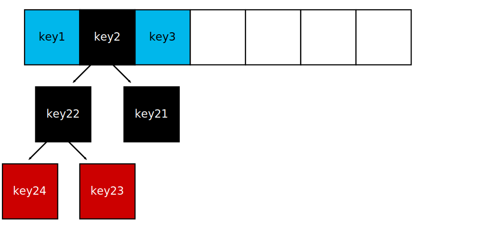
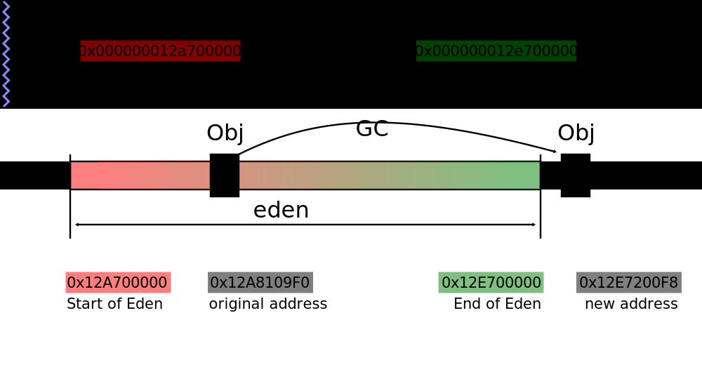
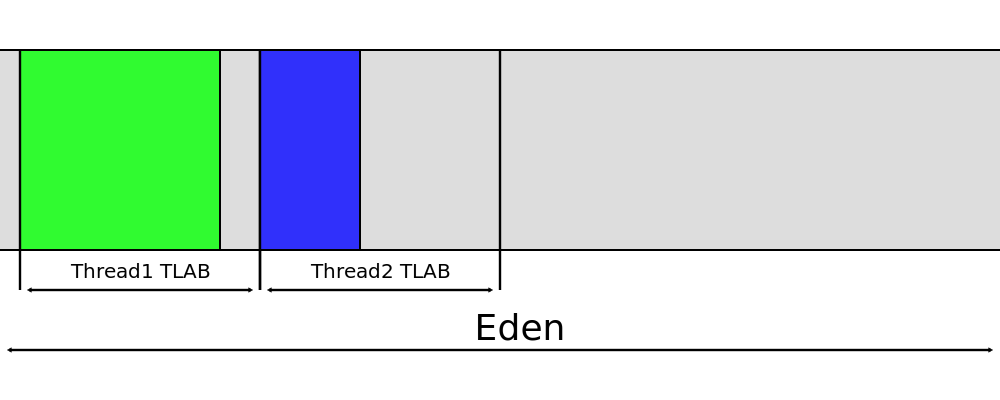

<link rel="stylesheet" href="highlight-default.css">
<link rel="stylesheet" href="github-gist.css">
<link rel="stylesheet" href="slidesstyles.css">

<script src="jquery.min.js"></script>
<script src="highlight.pack.js"></script>
<script>
$(document).ready(function() {
  $('pre code').each(function(i, e) {hljs.highlightBlock(e)});
});
</script>
<div class="footer"></div>
```{r setup, include=FALSE}
library(gdata)
library(ggplot2)

Sys.setlocale(category = "LC_ALL", locale = 'UTF-8')

rows = 1000
rows = 10000000

knitr::opts_chunk$set(echo = FALSE)
```

# no warranty

## ToC {.abstract`r sprintf("%d",rows)`} 
* A few theory
* hashCode calculation rules
    + hashCode-based DoS attack 
* HashCode as address of object - legend or myth
    + JVM internals: Unsafe, GC and allocations
    + Some battles on hashCode
* Make locks cheap again

## Associative array {.hash}


<pre><code class="java">int hash =  hash( key );
int index = Math.abs( hash ) % keys.length;
</code></pre>

## javadoc: {.javadoc}
### java.lang.Object

<pre><code class="java">public int hashCode()</code></pre>

Returns a hash code value for the object. This method is
supported for the benefit of hash tables such as those
provided by **HashMap**.

[https://docs.oracle.com/javase/8/docs/api/java/lang/Object.html](https://docs.oracle.com/javase/8/docs/api/java/lang/Object.html#hashCode--)

## Write down ( Alex, +79... )


## Search / insert complexity{.hashCodeComplexity}
<pre><code class="java">String key = "Alex";

int hash = key.hashCode();
int index = Math.abs( hash ) % keys.length;

if ( key.equals( keys[index] ) ) {
    return values[index];
}
return null;</code></pre>
<span class="huuuge highlight">complexity → **O(1)**</span>

## Contract of hashCode {.javadoc}

- consitency &amp; persistence

Whenever it is invoked on the same object more than once during
an execution of a Java application, the hashCode method <span class="highlight">must
_consistently_</span> return the <span class="highlight">same integer</span>, provided no information
used in equals comparisons on the object is modified.


[https://docs.oracle.com/javase/8/docs/api/java/lang/Object.html](https://docs.oracle.com/javase/8/docs/api/java/lang/Object.html#hashCode--)


## hashCode contract violation


## Collisions


## Chaining  {.chaining}


<span class="huuuge highlight">complexity → **O(N)**</span>

## hashCode - function of object content {.hashFunctionData}
<pre><code class="java">String s1 = new String("java");
String s2 = new String("java");

assert s1.hashCode() == s2.hashCode(); // <span class="hl">true</span>

Integer i1 = new Integer(42);
Integer i2 = new Integer(42);

assert i1.hashCode() == i2.hashCode(); // <span class="hl">true</span>
</code></pre>

## Polynomial hashCode {.polynomHashCode}

```
```

$$ hashCode = \sum_{k=0}^{n} {31^{n-k} \cdot property_k}  $$

## String.hashCode() {.stringHashCode}

<pre><code class="java">public final class String {
    private final char value[];
    private int hash; 
    
    public int hashCode() {
        int h = hash;
        if (h == 0 &amp;&amp; value.length &gt; 0) {
            char val[] = value;

            <span class="hl">for (int i = 0; i < value.length; i++) 
                h = 31 * h + val[i]</span>;
            
            hash = h;
        }
        return h;
    }
}</code></pre>

## String.hashCode is the part of public API {.stringHashCode}
<pre><code class="java">public final class String {
  /**
   * Returns a hash code for this string. The hash code
   * for a <span class="code">String</span> object is computed as
   *
   * <span class="hl">s[0]*31^(n-1) + s[1]*31^(n-2) + ... + s[n-1]</span>
   *
   * using <span class="code">int</span> arithmetic, where <span class="code">s[i]</span>
   * is the <i>i</i>th character of the string,
   * <span class="code">n</span> is the length of the string,
   * and <span class="code">^</span> indicates exponentiation.
   * (The hash value of the empty string is zero.)
   *
   * @return  a hash code value for this object.
   */
    public int hashCode() {        ...      }
}
</code></pre>

## java v.1.1.1 - String.hashCode() 
<pre><code class="java">public int hashCode() {
	int h = 0;
	int off = offset;
	char val[] = value;
	int len = count;

	if (len < 16) {
	    for (int i = len ; i > 0; i--) {
		    h = (h * 37) + val[off++];
	    }
	} else {
	    // only sample some characters
	    int skip = len / 8;
	    for (int i = len ; i > 0; i -= skip, off += skip) {
		    h = (h * 39) + val[off];
	    }
	}
	return h;
}</code></pre>

## 31 : Detective story {.detective31}

* <span class="huge">1997-04-17 (!!!)</span>: [java bug #4045622](http://bugs.java.com/bugdatabase/view_bug.do?bug_id=4045622)
    + All of the words and phrasesin Merriam-Webster's 2nd Int'l Dictionary (311_141 strings, avg length: 10 chars).
    + All of the strings in `/bin/*`, `/usr/bin/*`, `/usr/lib/*`, `/usr/ucb/*` &amp; `/usr/openwin/bin/*`  (66_304 strings, avg length: 21 chars).
    +  A list of URLs gathered by a web-crawler that ran for several hours last night (28_372 strings, avg length 49 characters).

<div class="center">polynomial of <span class="highlight huuuge">31</span>, <span class="highlight huuuge">33</span>, <span class="highlight huuuge">37</span> → min. avg collision length
</div>

## it might be found... {.AaBB}

<pre><code class="java">assert "Aa".hashCode() == "BB".hashCode();
</code></pre>

$$ 31 \cdot c_0 + c_1 = $$
$$ = 31 \cdot (c_0 - 1) + (c_1 + 31) $$

```
```
<div style="text-align: center;"><span class="huuuge">**`username`**</span> ⟹ <span class="huuuge">499_331</span> variants of collision</div>


# JMH

## Java Microbenchmark Harness :: example{.jmhExample}

<pre><code class="java">@State(Scope.Benchmark)
public class MapPerfTest {

  Map map;
  String[] keys;

  @Setup
  public void setup() { ..... }

<div class="hblock"><span class="hl">@Benchmark</span> @Threads( 1 )
public void fillMap( Blackhole blackhole ) {
  for (String key : keys)
    map.put(key, key);

  blackhole.consume( map );
}</div>
}</code></pre>

## Java Microbenchmark Harness :: example

<pre><code class="java"><span class="hl">@BenchmarkMode(Mode.AverageTime) @OutputTimeUnit(NANOSECONDS)
@Warmup(iterations = 5, time = 5, timeUnit = SECONDS)
@Measurement(iterations = 5, time = 5, timeUnit = SECONDS)</span>
@State(Scope.Benchmark)
public class MapPerfTest {

  Map map;
  String[] keys;

  @Setup
  public void setup() { ... }

  @Benchmark <span class="hl">@Threads( 1 )</span>
  public void fillMap( Blackhole bh ) {
    // ...
  }
}</code></pre>

## Java Microbenchmark Harness :: example{.jmhExample}

<pre><code class="java">@BenchmarkMode(Mode.AverageTime) @OutputTimeUnit(NANOSECONDS)
@Warmup(iterations = 5, time = 5, timeUnit = SECONDS)
@Measurement(iterations = 5, time = 5, timeUnit = SECONDS)
@State(Scope.Benchmark)
public class MapPerfTest {

  Map map;
  String[] keys;

<div class="hblock"><span class="hl">@Setup</span>
public void setup() {
  map = new HashMap();
  keys = <span class="hl">loadUsernameCollisionsFromFile()</span>;
}</div>

  @Benchmark @Threads( 1 )
  public void fillMap( Blackhole bh ) { ... }

}</code></pre>

## "username" collisions :: benchmark

<pre><code class="java">@Param( {"1", "1000", "10000", "100000", "150000", "200000"})
int size;
String[] keys;

@Setup
public void setup() {
  map = new HashMap&lt;String, String&gt;( size );
  keys = loadUsernameCollisionsFromFile( size );
}

<div class="hblock">@Benchmark
public void fillMap( Blackhole bh ) {
    for (String key : keys)
      map.put(key, key);

    bh.consume( map );
}</div></code></pre>

[CVE-2012-2739 java: hash table collisions CPU usage DoS](https://bugzilla.redhat.com/show_bug.cgi?id=750533)

## "username" collisions :: benchmark

<pre><code class="java">@Param( {"1", "1000", "10000", "100000", "150000", "200000"})
int size;
String[] keys;

@Setup
public void setup() {
  map = new HashMap&lt;String, String&gt;( size );
  keys = loadUsernameCollisionsFromFile( size );
}

@Benchmark
public void fillMap( Blackhole bh ) {
  for (String key : keys)
    map.put(key, key);

  bh.consume( map );
}
</code></pre>

<span class="highlight">[CVE-2012-2739 java: hash table collisions CPU usage DoS](https://bugzilla.redhat.com/show_bug.cgi?id=750533)</span>

## "username" collisions {.usernameCollisionsChart1}

```{r, out.height="600px", out.width="1000px"}

df = read.csv(file = "csv/username.csv", header = TRUE)
df7 <- subset(df, java == "java 7")

d <- transform(df7, time_per_op = time / size, time_sec = time / (10^9))

ggplot(data=d, aes(x=size, y=time_sec, group=java, colour=java)) +
  geom_line(linetype="solid", size=2) +
  geom_point(aes(shape=java),size=6) +
  scale_color_manual(values=c("java 8"="#1fbec3", "java 7"="#f57670")) +
  scale_shape_manual(values=c("java 8"=17, "java 7"=19))+
  scale_y_continuous(labels = function(n){format(n, big.mark = "_", scientific = FALSE)}) +
  scale_x_continuous(labels = function(n){format(n, big.mark = "_", scientific = FALSE)}) +
  labs(title = "seconds",
     x = "number of keys",
     y = "") +
  theme_classic() +
  theme(axis.text.y = element_text(size = 14, face = "bold")) +
  theme(axis.text.x = element_text(size = 14, face = "bold")) +
  theme(axis.title = element_text(size = 16, face = "bold")) +
  theme(axis.title.x=element_text(margin=margin(t=20))) +
  theme(title = element_text(size = 18, face = "bold")) +
  theme(legend.position="none", aspect.ratio = 0.5)
```


# 23derevo<br/><span style="font-size:0.5em;">derevo = tree (Rus.)</span>
<div style="text-align: right;">

</div>

## Binary search tree  {.rbTree}



<span class="huuuge highlight">complexity → **O( log(N) )**</span>

## "username" collisions

```{r, out.height="650px", out.width="1000px"}
df = read.csv(file = "csv/username.csv", header = TRUE)
df78 <- subset(df, java == "java 7" | java == "java 8")
d <- transform(df78, time_per_op = time / size, time_sec = time / (10^9))

ggplot(data=d, aes(x=size, y=time_sec, group=java, colour=java)) +
  geom_line(linetype="solid", size=2) +
  geom_point(aes(shape=java),size=6) +
  scale_color_manual(values=c("java 8"="#1fbec3", "java 7"="#f57670")) +
  scale_shape_manual(values=c("java 8"=17, "java 7"=19))+
  scale_y_continuous(labels = function(n){format(n, big.mark = "_", scientific = FALSE)}) +
  scale_x_continuous(labels = function(n){format(n, big.mark = "_", scientific = FALSE)}) +
  labs(title = "seconds",
     x = "number of keys",
     y = "") +
  theme_classic() +
  coord_cartesian(xlim = c(0,200000), ylim = c(0, 115)) +
  theme(axis.text.y = element_text(size = 14, face = "bold")) +
  theme(axis.text.x = element_text(size = 14, face = "bold")) +
  theme(axis.title = element_text(size = 16, face = "bold")) +
  theme(axis.title.x=element_text(margin=margin(t=20))) +
  theme(legend.text = element_text(size = 14, face = "bold")) +
  theme(title = element_text(size = 18, face = "bold")) +
  theme(aspect.ratio = 0.5)
```


## "username" collisions :: 500x zoom-in

```{r, out.height="650px", out.width="1000px"}
df = read.csv(file = "csv/username.csv", header = TRUE)
df78 <- subset(df, java == "java 8" | java == 'java 7')
d <- transform(df78, time_per_op = time / size, time_msec = time / (10^6))

ggplot(data=d, aes(x=size, y=time_msec, group=java, colour=java)) +
  geom_line(linetype="solid", size=2) +
  geom_point(aes(shape=java),size=6) +
  scale_color_manual(values=c("java 8"="#1fbec3", "java 7"="#f57670")) +
  scale_shape_manual(values=c("java 8"=17, "java 7"=19))+
  scale_y_continuous(labels = function(n){format(n, big.mark = "_", scientific = FALSE)}) +
  scale_x_continuous(labels = function(n){format(n, big.mark = "_", scientific = FALSE)}) +
  labs(title = "milliseconds",
     x = "number of keys",
     y = "") +
  theme_classic() +
  coord_cartesian(xlim = c(0,200000), ylim = c(0, 220)) +
  theme(axis.text.y = element_text(size = 14, face = "bold")) +
  theme(axis.text.x = element_text(size = 14, face = "bold")) +
  theme(axis.title = element_text(size = 16, face = "bold")) +
  theme(axis.title.x=element_text(margin=margin(t=20))) +
  theme(legend.text = element_text(size = 14, face = "bold")) +
  theme(title = element_text(size = 18, face = "bold")) +
  theme(aspect.ratio = 0.5)
```

## "username" collisions :: java 8 :: map.put(key, *)

```{r, out.height="650px", out.width="1000px"}
df <- read.csv(file = "csv/username.csv", header = TRUE)

df8 <- subset(df, java == "java 8")

d <- transform(df8, time_per_op = time / size, time_ms = time / (10^6), time_sec = time / (10^9))

ggplot(data=d, aes(x=size, y=time_per_op, group=java, colour=java)) +
  geom_line(linetype="solid", size=2) +
  geom_point(aes(shape=java),size=6) +
  scale_color_manual(values=c("java 8"="#1fbec3", "java 7"="#f57670")) +
  scale_shape_manual(values=c("java 8"=17, "java 7"=19))+
  scale_y_continuous(labels = function(n){format(n, big.mark = "_", scientific = FALSE)}) +
  scale_x_continuous(labels = function(n){format(n, big.mark = "_", scientific = FALSE)}) +
  labs(title = "single insert",
     x = "number of keys",
     y = "nanoseconds") +
  theme_classic() +
  theme(axis.text.y = element_text(size = 14, face = "bold")) +
  theme(axis.text.x = element_text(size = 14, face = "bold")) +
  theme(axis.title = element_text(size = 16, face = "bold")) +
  theme(legend.text = element_text(size = 14, face = "bold")) +
  theme(axis.title.y=element_text(margin=margin(r=20))) +
  theme(axis.title.x=element_text(margin=margin(t=20))) +
  theme(title = element_text(size = 18, face = "bold")) +
  theme(aspect.ratio = 0.5)


```

## "username" collisions :: Comparable

```{r, out.height="650px", out.width="1000px"}
df <- read.csv(file = "csv/cmp.csv", header = TRUE)

d <- transform(df, time_per_op = time / size, time_ms = time / (10^6), time_sec = time / (10^9))

ggplot(data=d, aes(x=size, y=time_sec, group=type, colour=type)) +
  geom_line(linetype="solid", size=2) +
  geom_point(aes(shape=type),size=6) +
  scale_color_manual(values=c("comparable"="#1fbec3", "java 7"="#f57670", "non-comparable"="#c987fc")) +
  scale_shape_manual(values=c("comparable"=17, "java 7"=19, "non-comparable"=18))+
  scale_y_continuous(labels = function(n){format(n, big.mark = "_", scientific = FALSE)}) +
  scale_x_continuous(labels = function(n){format(n, big.mark = "_", scientific = FALSE)}) +
  labs(title = "comparable VS non-comparable",
     x = "number of keys",
     y = "seconds") +
  theme_classic() +
  theme(axis.text.y = element_text(size = 14, face = "bold")) +
  theme(axis.text.x = element_text(size = 14, face = "bold")) +
  theme(axis.title = element_text(size = 16, face = "bold")) +
  theme(legend.text = element_text(size = 14, face = "bold")) +
  theme(axis.title.y=element_text(margin=margin(r=20))) +
  theme(axis.title.x=element_text(margin=margin(t=20))) +
  theme(title = element_text(size = 18, face = "bold")) +
  theme(aspect.ratio = 0.6)


```

# Object.hashCode<br/> <span style="margin-left:200px;">is a leaked abstraction</span>

# Urban Legend {.urbanLegendC}

<pre><code class="java">public int hashCode(){
  return <span class="hl">&this</span>;
}</code></pre>

## Urban Legend: the source  {.javadoc}
### java.lang.Object

<pre><code class="java">public int hashCode()</code></pre>

This is typically implemented by converting the <span class="highlight">internal address of the object</span> into an integer.

[https://docs.oracle.com/javase/8/docs/api/java/lang/Object.html](https://docs.oracle.com/javase/8/docs/api/java/lang/Object.html#hashCode--)

# Address of an object ?

# native method{.native}
<pre><code class="java">  package java.lang;

  public class Object {

      // ............

      public native int hashCode();
  }</code></pre>

## sun.misc.Unsafe{.unsafe}

<pre><code class="java">public native long allocateMemory(long bytes);

public native void freeMemory(long address);

public native void setMemory(Object o, 
    long offset, long bytes, byte value);
                 
public native long getLong(Object o, long offset);

public native void putLong(Object o, 
    long offset, long x);
    
// etc ...    
</code></pre>

## Unsafe :: address of an object{.unsafeaddress}
<pre><code class="java">private static Unsafe fetchUnsafe() {
  final Field field =
      <span class="hl">Unsafe.class.getDeclaredField( "theUnsafe" )</span>;
  field.setAccessible( true );
  return <span class="hl">(Unsafe) field.get( null )</span>;
}

public long getAddress(final Object object) {
  <span class="static">checkVMBooleanOption</span>("UseCompressedOops", false);

  Unsafe unsafe = fetchUnsafe();

  return unsafe.getLong( new Object[]{ object },
      unsafe.arrayBaseOffset( Object[].class ));
}
</code></pre>

## Unsafe :: address of an object{.unsafeaddress}
<pre><code class="java">private static Unsafe fetchUnsafe() {
  final Field field =
      Unsafe.class.getDeclaredField( "theUnsafe" );
  field.setAccessible( true );
  return (Unsafe) field.get( null );
}

public long getAddress(final Object object) {
  <span class="static">checkVMBooleanOption</span>("UseCompressedOops", false);

  Unsafe unsafe = fetchUnsafe();

  return <span class="hl">unsafe.getLong( new Object[]{ object },
      unsafe.arrayBaseOffset( Object[].class ))</span>;
}
</code></pre>

## Unsafe :: address of an object{.unsafeaddress}
<pre><code class="java">private static Unsafe fetchUnsafe() {
  final Field field =
      Unsafe.class.getDeclaredField( "theUnsafe" );
  field.setAccessible( true );
  return (Unsafe) field.get( null );
}

public long getAddress(final Object object) {
  <span class="hl"><span class="static">checkVMBooleanOption</span>("UseCompressedOops", false)</span>;

  Unsafe unsafe = fetchUnsafe();

  return unsafe.getLong( new Object[]{ object },
      unsafe.arrayBaseOffset( Object[].class ));
}
</code></pre>
<div style="text-align: center;"><span class="huuge">⟹<span class="highlight">-XX:-UseCompressedOops</span></span></div>
## Java Object Layout {.jol}

<pre><code class="java">Object theObject</span> = new Object();

VirtualMachine vm = VM.current();

long address = vm.<span class="hl">addressOf</span>( theObject );

long size = vm.<span class="hl">sizeOf</span>( theObject );

</code></pre>

## JOL : sizeOf( new Pair() ) {.jol2}

<div class="floating-box"><pre><code class="java">class Pair&lt;F, S&gt; {
  F first;
  S second;
}</code></pre></div>
<div class="floating-box"><pre><code class="java">class Pair2&lt;F, S&gt; {
  F first;
  S second;
  <span class="hl">int hashCode</span>;
}</code></pre></div><div style="clear:both"></div>

## JOL : -XX:+UseCompressedOops &amp; heap &lt; 4Gb {.jol2}

<div class="line"><code>-XX:+UseCompressedOops</code></div>
<div class="floating-box2"><code><span class="highlight">24 b</span></code></div>
<div class="floating-box2"><code><span class="highlight">24 b</span></code></div>
<div class="clear"></div>

<div class="floating-box"><pre><code class="java">class Pair&lt;F, S&gt; {
  F first;
  S second;
}</code></pre></div>
<div class="floating-box"><pre><code class="java">class Pair2&lt;F, S&gt; {
  F first;
  S second;
  int hashCode;
}</code></pre></div><div class="clear"></div>

## JOL : -XX:-UseCompressedOops OR heap &gt; 4Gb{.jol2}

<div class="line"><code>-XX:+UseCompressedOops</code></div>
<div class="floating-box2">24 b</div>
<div class="floating-box2">24 b</div><div class="clear"></div>

<div class="line"><code><span class="highlight">-XX:-UseCompressedOops</span></code></div>
<div class="floating-box2"><code><span class="highlight">32 b</span></code></div>
<div class="floating-box2"><code><span class="highlight">40 b</span></code></div>
<div class="clear"></div>

<div class="floating-box"><pre><code class="java">class Pair&lt;F, S&gt; {
  F first;
  S second;
}</code></pre></div>
<div class="floating-box"><pre><code class="java">class Pair2&lt;F, S&gt; {
  F first;
  S second;
  int hashCode;
}</code></pre></div><div class="clear"></div>

## Address &amp; hashCode


<code><span class="huuge">-XX:<span class="hashCode">hashCode=4</span></span></code>

## Follow the address of the object

<pre><code class="java">final Object <span class="hl">theObject</span> = new Object();
final long <span class="hl">initialAddress = getAddress( theObject )</span>;

List gcKeeper = new ArrayList();
gcKeeper.add( theObject );

long currentAddress = initialAddress;
while (initialAddress == currentAddress) {
    Object o = new Object();

    gcKeeper.add( o );

    currentAddress = getAddress( theObject );
}</code></pre>

```-Xms256m -Xmx256m -XX:+UseSerialGC```

## Follow the address of the object

<pre><code class="java">final Object theObject = new Object();
final long initialAddress = getAddress( theObject );

<span class="hl">List gcKeeper = new ArrayList();</span>
gcKeeper.add( theObject );

long currentAddress = initialAddress;
while (initialAddress == currentAddress) {
    <span class="hl">Object o = new Object();</span>

    <span class="hl">gcKeeper.add( o );</span>

    currentAddress = getAddress( theObject );
}</code></pre>

```-Xms256m -Xmx256m -XX:+UseSerialGC```

## Follow the address of the object

<pre><code class="java">final Object theObject = new Object();
final long initialAddress = getAddress( theObject );

List gcKeeper = new ArrayList();
gcKeeper.add( theObject );

long currentAddress = initialAddress;
<div class="hblock">while (<span class="hl">initialAddress == currentAddress</span>) {
    Object o = new Object();

    gcKeeper.add( o );

    <span class="hl">currentAddress = getAddress( theObject )</span>;
}</div></code></pre>

```-Xms256m -Xmx256m -XX:+UseSerialGC```

## Follow the address of the object

<pre><code class="java">final Object theObject = new Object();
final long initialAddress = getAddress( theObject );

List gcKeeper = new ArrayList();
gcKeeper.add( theObject );

long currentAddress = initialAddress;
while (initialAddress == currentAddress) {
    Object o = new Object();

    gcKeeper.add(o);

    currentAddress = getAddress( theObject );
}</code></pre>

<code><span class="highlight">-Xms256m -Xmx256m -XX:+UseSerialGC</span></code>

# demo

## GC: generations {.generations}


GC: Serial / Parallel / CMS

## Follow the address of the object together with GC

<pre><code class="java">final Object theObject = new Object();
final long initialAddress = getAddress( theObject );

List gcKeeper = new ArrayList();
gcKeeper.add( theObject );

long currentAddress = initialAddress;
while (initialAddress == currentAddress) {
    Object o = new Object();

    gcKeeper.add(o);

    currentAddress = getAddress( theObject );
}</code></pre>

<code><span class="highlight">-XX:+PrintGCDetails</span> -Xmx256m -XX:+UseSerialGC</code>

## GC is more than just a garbage collection



## Follow the hashcode
<pre><code class="java">final Object <span class="hl">theObject</span> = new Object();
final long initialHashCode = <span class="hl">theObject.hashCode()</span>;

List gcKeeper = new ArrayList();
gcKeeper.add(theObject);

long currentHashCode = initialHashCode;
while (<span class="hl">initialHashCode == currentHashCode</span>) {
    Object o = new Object();

    gcKeeper.add(o);

    currentHashCode = <span class="hl">theObject.hashCode()</span>;
}

</code></pre>
```-Xms256m -Xmx256m -XX:+UseSerialGC```

# demo

## Hidden property {.native}
<pre><code class="java">package java.lang;

public class Object {

    // other methods

    public native int hashCode();

}
</code></pre>

## Object memory dump


Intel X86: Little Endian

## How much could fit in heap ? {.heap}

<code><span class="huuge">-Xmx256m</span></code>
<pre><code class="java">
long freeMemory =
  Runtime.getRuntime().freeMemory();

<span class="right">= <span class="hl">239_942_568</span></span>

freeMemory / vm.sizeOf( new Object() )

<span class="right">= <span class="huuge hl">14_996_410</span></span>
</code></pre>

## Collisions boundary {.IdentityHashCodeCollision}

<pre><code class="java">final int maxCollisions = 1;
final int[] collisions = new int[maxCollisions];

final List gcKeeper = new ArrayList();
final TIntSet uniqueHashCodes = new TIntHashSet();

<div class="hblock">for (int collisionNo = 0; collisionNo < maxCollisions; ) {
	final Object <span class="hl">obj = new Object()</span>;
	gcKeeper.add(obj);

	int hashCode = <span class="hl">obj.hashCode()</span>;

	if ( <span class="hl">! uniqueHashCodes.add(hashCode)</span> )
		collisions[collisionNo++] = hashCode;
}</div>
</code></pre>
<code>-Xms256m -Xmx256m -XX:+UseSerialGC -XX:<span class="hashCode">hashCode=4</span></code>

#demo

## Young generation {.heapSize}

<pre><code>eden space <span class="highlight huuge">65536K</span>, 2% used
[0x000000012a700000, 0x000000012a8db400, 0x000000012e700000)
Object reallocated: 0x12A8109F0 -> 0x12E7200F8
</code></pre>

<pre><code class="java">
65536K / vm.sizeOf( new Object() )

= <span class="huuge hl">4_194_304</span>
</code></pre>

## hashCode space{.hashCode22Bit}

<div class="center">
<br/>
<span class="huuuge">32bit → 22bit</span><br/><br/>
<br/>
<code>= <span class="huge">4_194_304</span></code> <br/>
unique values</div>

## Collisions boundary - results {.IdentityHashCodeCollisionResults}
<pre>
after 1,331,460 allocation:
hash code collision at 0x3055A9<span class="huuge highlight">9</span>0
hash code collision at 0x3055A9<span class="huuge highlight">A</span>0
hash code collision at 0x3055A9<span class="huuge highlight">B</span>0
hash code collision at 0x3055A9<span class="huuge highlight">C</span>0
hash code collision at 0x3055A9<span class="huuge highlight">D</span>0
hash code collision at 0x3055A9<span class="huuge highlight">E</span>0
hash code collision at 0x3055A9<span class="huuge highlight">F</span>0
</pre>

# hashCode → address → <br/> <span style="margin-left:200px;">→ memory allocation</span>

## Memory allocation  {.simpleAllocation}
 
<pre><code class="java">public interface Allocator {
    long malloc(long size);
}

class SimpleAllocator implements Allocator {
    private long memoryPointer;

    @Override
    public long malloc(long size) {
        long old = memoryPointer;
        memoryPointer += size;
        return old;
    }
}
</code></pre>

## Let's fix malloc: SyncAllocator {.syncAllocation}

<pre><code class="java">class SyncAllocator implements Allocator {
    private long memoryPointer;

    @Override
    public <span class="hl">synchronized</span> long malloc(long size) {
        long old = memoryPointer;
        memoryPointer += size;
        return old;
    }
}
</code></pre>

## SyncAllocator Performance Benchmark {.syncAllocationBenchmark}
<pre><code class="java">@Benchmark @Threads( 4 )
public long syncAllocator() {
    return syncAllocator.malloc( 16 );
}</code></pre>

## SyncAllocator Performance Benchmark {.syncAllocationBenchmark}
```{r, fig.width=10, fig.height=5}
df = read.csv(file = "csv/allocations.csv", header = TRUE)
df <- subset(df, alloc == "single-threaded" | alloc == 'sync')

ggplot(data=df, aes(x=reorder(alloc, -pos), y=value, fill=alloc)) +
  geom_bar(stat="identity",  colour="#444444", alpha=0.95) +
  geom_errorbar(aes(ymin = value - error, ymax = value + error),  width=.5, position=position_dodge(0.5)) +
  scale_fill_manual(values=c('single-threaded'='#21bd83', 'java'='#a9a518','sync'='#fa8074', 'cas'='#00b3f6', 'tlab'='#e67bf3')) +
  geom_text(aes(label=value), hjust=-0.3, vjust=-0.4, size=5, fontface = "bold") +
  coord_flip() +
  labs(title = "sync @Threads ( 4 ), single-threaded @Threads( 1 )",
       x = "",
       y = "ns/op") +
  theme_classic() +
  scale_y_continuous(limits=c(0, max(df$value) + 30), expand = c(0, 0)) +
  theme(axis.text.y = element_text(size = 16, face = "bold")) +
  theme(axis.title = element_text(size = 16, face = "bold")) +
  theme(legend.position="none")
```


# Can make it better ?

# Compare-and-Set

## CAS Allocator {.casAllocation}
<pre><code class="java">class CASAllocator implements Allocator {
    private final AtomicLong memoryPointer = 
        new <span class="hl">AtomicLong</span>();

    @Override
    public long malloc(long size) {
        return memoryPointer.<span class="hl">getAndAdd</span>( size );
    }
}
</code></pre>

## Allocators Performance Benchmark {.casAllocationBenchmark}
<pre><code class="java">@Benchmark @Threads( 4 )
public long casAllocator() {
    return casAllocator.malloc( 16 );
}
</code></pre>

## Allocators Performance Benchmark {.casAllocationBenchmark}

```{r, fig.width=10, fig.height=5}
df = read.csv(file = "csv/allocations.csv", header = TRUE)
df <- subset(df, alloc == "cas" | alloc == 'sync' | alloc == "single-threaded" )

ggplot(alpha=0.3, data=df, aes(x=reorder(alloc, -pos), y=value, fill=alloc)) +
  geom_bar(stat="identity",  colour="#444444", alpha=0.95) +
  geom_errorbar(aes(ymin = value - error, ymax = value + error),  width=.5, position=position_dodge(0.5)) +
  scale_fill_manual(values=c('single-threaded'='#21bd83', 'java'='#a9a518','sync'='#fa8074', 'cas'='#00b3f6', 'tlab'='#e67bf3')) +
  geom_text(aes(label=value), hjust=-0.3, vjust=-0.4, size=5, fontface = "bold") +
  coord_flip() +
  labs(title = "sync/cas @Threads ( 4 ), single-threaded @Threads( 1 )",
       x = "",
       y = "ns/op") +
  theme_classic() +
  scale_y_continuous(limits=c(0, max(df$value) + 30), expand = c(0, 0)) +
  theme(axis.text.y = element_text(size = 16, face = "bold")) +
  theme(axis.title = element_text(size = 16, face = "bold")) +
  theme(legend.position="none")
```


## Java Allocation {.javaAllocation}
<pre><code class="java">@Benchmark @Threads( 4 )
public Object javaAllocation() {
    return new Object();
}
</code></pre>

## Java Allocation {.javaAllocation}

```{r, fig.width=10, fig.height=5}
df = read.csv(file = "csv/allocations.csv", header = TRUE)
df <- subset(df, alloc == "cas" | alloc == "java" | alloc == "sync" | alloc == "single-threaded")

ggplot(alpha=0.3, data=df, aes(x=reorder(alloc, -pos), y=value, fill=alloc)) +
  geom_bar(stat="identity",  colour="#444444", alpha=0.95) +
  geom_errorbar(aes(ymin = value - error, ymax = value + error),  width=.5, position=position_dodge(0.5)) +
  scale_fill_manual(values=c('single-threaded'='#21bd83', 'java'='#a9a518','sync'='#fa8074', 'cas'='#00b3f6', 'tlab'='#e67bf3')) +
  geom_text(aes(label=value), hjust=-0.3, vjust=-0.4, size=5, fontface = "bold") +
  coord_flip() +
  labs(title = "@Threads( 4 )",
       x = "",
       y = "ns/op") +
  theme_classic() +
  scale_y_continuous(limits=c(0, max(df$value) + 30), expand = c(0, 0)) +
  theme(axis.text.y = element_text(size = 16, face = "bold")) +
  theme(axis.title = element_text(size = 16, face = "bold")) +
  theme(legend.position="none")
```


# Can make it even better ?

# hashCode distribution over threads

## hashCode distribution : Expectations

```{r, out.height="600px", out.width="1000px", echo = FALSE}
df = read.csv(file = "csv/hashCodesNoTLAB.csv", nrows = 36, header = TRUE)

ggplot(data=df, mapping = aes(x = address, y = index, group=thread, colour=thread, shape=thread)) +
  geom_point(size=4) +
  theme_classic() +
  labs(
    title="number of objects",
    x = "addresses of objects",
    y = "") +
  scale_shape_manual(values=c("thread-0"=17, "thread-1"=19, "thread-2"=15, "thread-3"=9))+
  scale_y_continuous(breaks=c(0,1,2,3,4,5,6,7,8,9,10), labels = function(n){format(n, big.mark = "_", scientific = FALSE)}, expand = c(0, 0)) +
  scale_x_continuous(breaks=c(807437768, 807437928, 807438088, 807438248), labels = function(n){ifelse(n == 807437768,  base::sprintf("base"), base::sprintf("+ %d", as.integer(n - 807437768)))}, expand = c(0, 0)) +
  theme(axis.title = element_text(size = 16, face = "bold")) +
  theme(axis.text.y = element_text(size = 14, face = "bold")) +
  theme(axis.text.x = element_text(size = 14, face = "bold")) +
  theme(axis.title = element_text(size = 16, face = "bold")) +
  theme(axis.title.x=element_text(margin=margin(t=20))) +
  theme(legend.text = element_text(size = 14, face = "bold")) +
  theme(title = element_text(size = 16, face = "bold")) +

  theme(aspect.ratio = 0.7)
```

## hashCode distribution over 4 threads {.hashCode20Bit}

```{r, out.height="600px", out.width="1000px", echo = FALSE}
df = read.csv(file = "csv/hashCodes.csv", header = TRUE)

ggplot(data=df, mapping = aes(x = address, y = index, group=thread, colour=thread, shape=thread)) +
  geom_point(size=1) +
  theme_classic() +
  labs(
    title="number of objects",
    x = "addresses of objects",
    y = "") +
  geom_vline(xintercept = 809203744) +
  geom_hline(yintercept = 890552) +
  scale_shape_manual(values=c("thread-0"=17, "thread-1"=19, "thread-2"=15, "thread-3"=9))+
  scale_y_continuous(breaks=c(200000,400000,600000,800000,1000000), labels = function(n){format(n, big.mark = "_", scientific = FALSE)}, expand = c(0, 0)) +
  scale_x_continuous(breaks=c(808757360,842311792,875866224), labels = function(n){ifelse(n == 808757360, base::sprintf("base"), base::sprintf("+ %d MB", as.integer((n - 808757360) / 1024/1024)))}, expand = c(0.2, 1000)) +
  theme(axis.title = element_text(size = 16, face = "bold")) +
  theme(axis.text.y = element_text(size = 14, face = "bold")) +
  theme(axis.text.x = element_text(size = 14, face = "bold")) +
  theme(axis.title = element_text(size = 16, face = "bold")) +
  theme(axis.title.x=element_text(margin=margin(t=20))) +
  theme(legend.text = element_text(size = 14, face = "bold")) +
  theme(title = element_text(size = 16, face = "bold")) +
  theme(aspect.ratio = 0.7)
```

## The bad news: 1 mln of unique values{.hashCode20Bit}

$$ uniqueValues = {{EdenSize} \over {sizeOf(Object) \cdot threads}} = $$
$$ = 1048576$$
$$ bits = log_2{1048576} = 20 $$

<div class="center"><span class="huuuge">22bit → 20bit</span></div>

## The good news {.hashCodeDistribution}

```{r, out.height="600px", out.width="1000px", echo = FALSE}
df = read.csv(file = "csv/hashCodes.csv", nrows = 36, header = TRUE)

ggplot(data=df, mapping = aes(x = address, y = index, group=thread, colour=thread, shape=thread)) +
  geom_point(size=5) +
  theme_classic() +
  labs(
    title="number of objects",
    x = "addresses of objects",
    y = "") +
  scale_shape_manual(values=c("thread-0"=17, "thread-1"=19, "thread-2"=15, "thread-3"=9))+
  scale_y_continuous(breaks=c(0,1,2,3,4,5,6,7,8,9,10), labels = function(n){format(n, big.mark = "_", scientific = FALSE)}, expand = c(0, 0)) +
  scale_x_continuous(breaks=c(808757360,809473680,810190000,810906320), labels = function(n){ifelse(n == 808757360, base::sprintf("base"), base::sprintf("+ %d KiB", as.integer((n - 808757360)/1024)))}, expand = c(0.2, 1000)) +
  theme(axis.title = element_text(size = 16, face = "bold")) +
  theme(axis.text.y = element_text(size = 14, face = "bold")) +
  theme(axis.text.x = element_text(size = 14, face = "bold")) +
  theme(axis.title = element_text(size = 16, face = "bold")) +
  theme(axis.title.x=element_text(margin=margin(t=20))) +
  theme(legend.text = element_text(size = 14, face = "bold")) +
  theme(title = element_text(size = 16, face = "bold")) +

  theme(aspect.ratio = 0.7)
```

## Let's grab **HUGE** pieces of memory ! {.tlabcode}
<pre><code class="java">public class TLABLikeAllocator implements Allocator {
  private static final long <span class="hl">SIZE = 1024L * 1024L</span>;
  
  private final AtomicLong memoryPointer = new AtomicLong();
  private final ThreadLocal&lt;AddressHolder&gt; threadLocal =
       ThreadLocal.withInitial(() -&gt; new AddressHolder());

  public long malloc( long size ) {
    AddressHolder addressHolder = threadLocal.get();
    while( true ) {
      if (addressHolder.value + size &lt;= addressHolder.maxValue) {
          long old = addressHolder.value;
          addressHolder.value += size;
          return old;
      }

      long value = memoryPointer.getAndAdd( SIZE );
      addressHolder.value = value;
      addressHolder.maxValue = value + SIZE;
    }
  }
}
</code></pre>

## Let's grab **HUGE** pieces of memory ! {.tlabcode}
<pre><code class="java">public class TLABLikeAllocator implements Allocator {
  private static final long SIZE = 1024L * 1024L;
  
  private final AtomicLong <span class="hl">memoryPointer = new AtomicLong()</span>;
  private final ThreadLocal&lt;AddressHolder&gt; threadLocal =
       ThreadLocal.withInitial(() -&gt; new AddressHolder());

  public long malloc( long size ) {
    AddressHolder addressHolder = threadLocal.get();
    while( true ) {
      if (addressHolder.value + size &lt;= addressHolder.maxValue) {
          long old = addressHolder.value;
          addressHolder.value += size;
          return old;
      }

      long value = <span class="hl">memoryPointer.getAndAdd( SIZE )</span>;
      addressHolder.value = value;
      addressHolder.maxValue = value + SIZE;
    }
  }
}
</code></pre>

## Let's grab **HUGE** pieces of memory ! {.tlabcode}
<pre><code class="java">public class TLABLikeAllocator implements Allocator {
  private static final long SIZE = 1024L * 1024L;
  
  private final AtomicLong memoryPointer = new AtomicLong();
  private final ThreadLocal&lt;AddressHolder&gt; threadLocal =
       <span class="hl">ThreadLocal.withInitial(() -&gt; new AddressHolder())</span>;

  public long malloc( long size ) {
    AddressHolder addressHolder = threadLocal.get();
    while( true ) {
      <span class="hl">if (addressHolder.value + size &lt;= addressHolder.maxValue) {
          long old = addressHolder.value;
          addressHolder.value += size;
          return old;
      }</span>

      long value = memoryPointer.getAndAdd( SIZE );
      addressHolder.value = value;
      addressHolder.maxValue = value + SIZE;
    }
  }
}
</code></pre>
## Allocators Performance Benchmark {.tlabAllocatorBenchmark}
<pre><code class="java">@Benchmark @Threads( 4 )
public long tlabAllocator() {
    return tlabAllocator.malloc( 16 );
}</code></pre>

## Allocators Performance Benchmark {.tlabAllocatorBenchmark}
```{r, fig.width=10, fig.height=5}

df = read.csv(file = "csv/allocations.csv", header = TRUE)
df <- subset(df, alloc == "cas" | alloc == "java" | alloc == "sync" | alloc == "tlab" )

ggplot(alpha=0.3, data=df, aes(x=reorder(alloc, -pos), y=value, fill=alloc)) +
  geom_bar(stat = "identity", colour="#444444", alpha=0.95) +
  geom_text(aes(label=value), hjust=-0.3, vjust=-0.4, size=5, fontface = "bold") +
  geom_errorbar(aes(ymin = value - error, ymax = value + error),  width=.5, position=position_dodge(0.5)) +
  scale_fill_manual(values=c('single-threaded'='#21bd83', 'java'='#a9a518','sync'='#fa8074', 'cas'='#00b3f6', 'tlab'='#e67bf3')) +
  coord_flip() +
  labs(title = "@Threads( 4 )",
       x = "",
       y = "ns/op") +
  theme_classic() +
  scale_y_continuous(limits=c(0, max(df$value) + 25), expand = c(0, 0)) +
  theme(axis.text.y = element_text(size = 16, face = "bold")) +
  theme(axis.title = element_text(size = 16, face = "bold")) +
  theme(legend.position="none")
```


## Thread Local Allocation Buffer



## Thread Local Allocation Buffer


## hashCode distribution NO TLAB {.hashCodeDistribution}

```{r, out.height="600px", out.width="1000px", echo = FALSE}
df = read.csv(file = "csv/hashCodesNoTLAB.csv", nrows = 36, header = TRUE)

ggplot(data=df, mapping = aes(x = address, y = index, group=thread, colour=thread, shape=thread)) +
  geom_point(size=5) +
  theme_classic() +
  labs(
    title="number of objects",
    x = "addresses of objects",
    y = "") +
  scale_shape_manual(values=c("thread-0"=17, "thread-1"=19, "thread-2"=15, "thread-3"=9))+
  scale_y_continuous(breaks=c(0,1,2,3,4,5,6,7,8,9,10), labels = function(n){format(n, big.mark = "_", scientific = FALSE)}, expand = c(0, 0)) +
  scale_x_continuous(breaks=c(807437768, 807437928, 807438088, 807438248), labels = function(n){ifelse(n == 807437768,  base::sprintf("base"), base::sprintf("+ %d", as.integer(n - 807437768)))}, expand = c(0, 0)) +
  theme(axis.title = element_text(size = 16, face = "bold")) +
  theme(axis.text.y = element_text(size = 14, face = "bold")) +
  theme(axis.text.x = element_text(size = 14, face = "bold")) +
  theme(axis.title = element_text(size = 16, face = "bold")) +
  theme(axis.title.x=element_text(margin=margin(t=20))) +
  theme(legend.text = element_text(size = 14, face = "bold")) +
  theme(title = element_text(size = 16, face = "bold")) +

  theme(aspect.ratio = 0.7)
```

## Cost of TLAB {.tlabAllocatorBenchmark}

<pre><code class="java">@Benchmark @Threads( 4 )
public Object allocate() {
   return new Object();
}</code></pre>

<div class="center"><span class="huuuge">-XX:<span class="highlight">+</span>UseTLAB</span> vs <span class="huuuge">-XX:<span class="highlight">-</span>UseTLAB</span></div>
## Cost of TLAB {.tlabAllocatorBenchmark}

```{r, fig.width=10, fig.height=5}
df = read.csv(file = "csv/UseTLAB.csv", header = TRUE)
ggplot(alpha=0.3, data=df, aes(x=type, y=value, fill=type)) +
  geom_bar(stat="identity",  colour="black") +
  scale_fill_manual(values=c("-XX:-UseTLAB"='#f57670', "-XX:+UseTLAB"="#1fbec3")) +
  geom_errorbar(aes(ymin = value - error, ymax = value + error),  width=.5, position=position_dodge(0.5)) +
  geom_text(aes(label=value), hjust=-0.6, size=5, fontface = "bold") +
  coord_flip() +
  labs(title = "@Threads( 4 )",
       x = "",
       y = "ns/op") +
  scale_y_continuous(limits = c(0, max(df$value) + 70), expand = c(0, 0)) +
  theme_classic() +
  theme(axis.text.y = element_text(size = 16, face = "bold")) +
  theme(axis.title = element_text(size=16, face = "bold"))+
  theme(legend.position="none")
```


# <span class="huuge">32bit → 20bit</span>

# What if it is a <span class="huuge">Random</span> number ?

## Birthday problem {.paradox}

$$p_{uniq}(n) = \left({1 - \frac{1}{d}}\right)\cdot\left({1 - \frac{2}{d}}\right)\cdot\ldots\cdot\left({1 - \frac{n - 1}{d}}\right) = $$
$$ = \frac{d}{d^{n} \cdot (d - n)!}$$


$$ n \approx \sqrt{2  d \cdot ln({1\over{1 - p_{uniq}}}) }$$
<div class="center">using <span class="huge">$$ \ d = 2^{32}, \ p = 0.5 \Rightarrow $$</span> <span class="huuuge">$$ n \approx  77162 $$</span></div>

## -XX:hashCode {.XXhashCode}

-XX:hashCode=k | Type
---------------|----------
  0 | <span class="good">[Park-Miller RNG](https://en.wikipedia.org/wiki/Lehmer_random_number_generator) </span>
  1 | <span class="bad">fn(address of object, global state)</span>
  2 | <span class="bad">const 1</span>
  3 | <span class="good">incremental counter</span>
  4 | <span class="huuge highlight">address of object</span>
  5 | <span class="good">[Marsagliа xor-shift RNG](https://en.wikipedia.org/wiki/Xorshift)</span> _**by default** in java 8_

## Memory dump of object -XX:hashCode=5


## Distribution of 10 millions objects in 10 threads
```{r  fig.width=10.5, fig.height=6, echo = FALSE}

addressHashCode = read.csv(file = "csv/addressHashCode.csv", nrows = rows, header = TRUE)
defaultHashCode = read.csv(file = "csv/defaultHashCode.csv", nrows = rows, header = TRUE)
ggplot() +
  geom_histogram(data=addressHashCode, aes(x=hashCode, fill="address"), alpha=0.7, bins = 800) +
  geom_histogram(data=defaultHashCode, aes(x=hashCode, fill="MXSRng"), alpha=0.7, bins = 800) +
  scale_fill_manual(name="type hashCode:", labels=c("address"="address", "MXSRng"="MXS-rng"), values=c("address" = "#003dae", "MXSRng" = "#ae003d")) +
  labs(title =
         sprintf("collisions by address: %s k, by MXS-rng: %s k",
                 round( sum(duplicated(addressHashCode)) / 1000, 1),
                 round( sum(duplicated(defaultHashCode)) / 1000, 1)),
       x = "hashCode") +
  theme_classic() +
  theme(axis.title.y=element_blank()) +
  scale_y_continuous(labels = function(n){format(n, big.mark = "_", scientific = FALSE)}, expand = c(0, 0)) +
  scale_x_continuous(labels = function(n){format(n, big.mark = "_", scientific = FALSE)}, expand = c(0, 0)) +
  theme(axis.title = element_text(size = 16, face = "bold")) +
  theme(axis.text.y = element_text(size = 14, face = "bold")) +
  theme(axis.text.x = element_text(size = 14, face = "bold")) +
  theme(axis.title = element_text(size = 16, face = "bold")) +
  theme(axis.title.x=element_text(margin=margin(t=20))) +
  theme(legend.text = element_text(size = 14, face = "bold")) +
  theme(title = element_text(size = 16, face = "bold")) +

  theme(aspect.ratio = 9/16)
```

## has hashCode been calculated ?

```{r, fig.width=10, fig.height=5}

df = read.csv(file = "csv/allocations.csv", header = TRUE)
df <- subset(df, alloc == "java" | alloc == "tlab" )

ggplot(alpha=0.3, data=df, aes(x=reorder(alloc, -pos), y=value, fill=alloc)) +
  geom_bar(stat = "identity", colour="#444444", alpha=0.95) +
  geom_text(aes(label=value), hjust=-0.2, vjust=-0.7, size=5, fontface = "bold") +
  geom_errorbar(aes(ymin = value - error, ymax = value + error),  width=.5, position=position_dodge(0.5)) +
  scale_fill_manual(values=c('single-threaded'='#21bd83', 'java'='#a9a518','sync'='#fa8074', 'cas'='#00b3f6', 'tlab'='#e67bf3')) +
  coord_flip() +
  labs(title = "@Threads( 4 )",
       x = "",
       y = "ns/op") +
  theme_classic() +
  scale_y_continuous(limits=c(0, max(df$value) + 4), expand = c(0, 0)) +
  theme(axis.text.y = element_text(size = 16, face = "bold")) +
  theme(axis.title = element_text(size = 16, face = "bold")) +
  theme(legend.position="none")
```


## Object.hashCode() benchmark {.javaAllocation}
<pre><code class="java">@Benchmark @Threads( 4 )
public Object javaHashCode() {
      Object object = new Object();
      object.<span class="hl">hashCode()</span>;
      return object;
  }
</code></pre>

## Object.hashCode() benchmark

```{r, fig.width=10, fig.height=5}

df = read.csv(file = "csv/allocations.csv", header = TRUE)
df <- subset(df, alloc == "java" | alloc == "javaHashCode" | alloc == "tlab" )

ggplot(alpha=0.3, data=df, aes(x=reorder(alloc, -pos), y=value, fill=alloc)) +
  geom_bar(stat = "identity", colour="#444444", alpha=0.95) +
  geom_text(aes(label=value), hjust=-0.2, vjust=-0.7, size=5, fontface = "bold") +
  geom_errorbar(aes(ymin = value - error, ymax = value + error),  width=.5, position=position_dodge(0.5)) +
  scale_fill_manual(values=c('single-threaded'='#21bd83', 'java'='#a9a518','sync'='#fa8074', 'cas'='#00b3f6', 'tlab'='#e67bf3', 'javaHashCode'='#888888')) +
  coord_flip() +
  labs(title = "@Threads( 4 )",
       x = "",
       y = "ns/op") +
  theme_classic() +
  scale_y_continuous(limits=c(0, max(df$value) + 15), expand = c(0, 0)) +
  theme(axis.text.y = element_text(size = 16, face = "bold")) +
  theme(axis.title = element_text(size = 16, face = "bold")) +
  theme(legend.position="none")
```


## Memory dump of object right after creation {.objectDumpRightAfterCreation}  

<pre><code class="java">Object object = new Object();

String dump = dump(object);
</code></pre>


# monitor {.nativeMonitor}
<pre><code class="java">public class Object {
  //// other methods
  public final native void notify();

  public final native void wait(long timeout)
      throws InterruptedException;
}

</code></pre>


## Biased Locking


## Biased Locking demo:  {.biasedDemo}
<pre><code class="java">synchronized (object) {
    object.notifyAll();
}
String dump = dump(object);
</code></pre>


## StringBufferPerfTest {.StringBufferPerfTestSingle}

<pre><code class="java">StringBuffer buffer = new StringBuffer();

@Benchmark @Thread(1)
public String bufferToString() {    
  return buffer.toString(); 
}</code></pre>

<code><span class="highlight">-XX:+UseBiasedLocking</span></code> VS <code><span class="highlight">-XX:-UseBiasedLocking</span></code>

```
```

<code>-XX:BiasedLockingStartupDelay=0</code>

## StringBufferPerfTest {.StringBufferPerfTestSingle}

<pre><code class="java">StringBuffer buffer = new StringBuffer();

@Benchmark @Thread(1)
public String bufferToString() {    
  return buffer.toString(); 
}</code></pre>

<code>-XX:+UseBiasedLocking</code> VS <code>-XX:-UseBiasedLocking</code>

```
```

<code><span class="highlight">-XX:BiasedLockingStartupDelay=0</span></code>


## StringBufferPerfTest results

```{r, fig.width=10, fig.height=5}
df = read.csv(file = "csv/StringBufferPerfTest.csv", header = TRUE)

df <- subset(df, type == "-XX:+UseBiasedLocking" | type == "-XX:-UseBiasedLocking" )

ggplot(alpha=0.3, data=df, aes(x=type, y=value, fill=type)) +
  geom_bar(stat="identity",  colour="black") +
  scale_fill_manual(values=c('-XX:+UseBiasedLocking'='#1fbec3', '-XX:-UseBiasedLocking'='#f57670')) +
  geom_errorbar(aes(ymin = value - error, ymax = value + error),  width=.5, position=position_dodge(0.5)) +
  geom_text(aes(label=value), hjust=-0.2, vjust=-0.7, size=5, fontface = "bold") +
  coord_flip() +
  theme_classic() +
  labs(title = "@Threads( 1 )",
       x = "",
       y = "ns/op") +
  scale_y_continuous(limits=c(0,max(df$value)+5), expand = c(0, 0)) +
  theme(axis.text.y = element_text(size = 16, face = "bold")) +
  theme(axis.title = element_text(size=16, face = "bold"))+
  theme(legend.position="none")
```


## identityHashCode

<pre><code class="java">StringBuffer buffer = new StringBuffer();
StringBuffer <span class="hl">bufferWithIdHashCode</span> = new StringBuffer();

@Setup
public void setup(Blackhole bh) {
    bh.consume( System.identityHashCode( 
        bufferWithIdHashCode ) );
}

@Benchmark  @Thread(1)
public String bufferWithIdHashCode() {
  return <span class="hl">bufferWithIdHashCode</span>.toString();
}

@Benchmark @Thread(1)
public String buffer() {
  return buffer.toString();
}</code></pre>

## identityHashCode

<pre><code class="java">StringBuffer buffer = new StringBuffer();
StringBuffer bufferWithIdHashCode = new StringBuffer();

@Setup
public void setup(Blackhole bh) {
    bh.consume( <span class="hl">System.identityHashCode( 
        bufferWithIdHashCode )</span> );
}

@Benchmark  @Thread(1)
public String bufferWithIdHashCode() {
  return bufferWithIdHashCode.toString();
}

@Benchmark  @Thread(1)
public String buffer() {
  return buffer.toString();
}</code></pre>

## identityHashCode results

```{r, fig.width=10, fig.height=5}
df = read.csv(file = "csv/StringBufferPerfTest.csv", header = TRUE)

df <- subset(df, type == "buffer -XX:-UseBiasedLocking" | type == 'buffer' | type == 'bufferWithIdHashCode')

ggplot(alpha=0.7, data=df, aes(x=reorder(type, -pos), y=value, fill=type)) +  
  geom_bar(stat="identity",  colour="black") +
  scale_fill_manual(values=c('buffer -XX:-UseBiasedLocking'='#fa8074', 'buffer'='#21bd83', 'bufferWithIdHashCode'='#e67bf3')) +
  geom_errorbar(aes(ymin = value - error, ymax = value + error),  width=.5, position=position_dodge(0.5)) +
  geom_text(aes(label=value), hjust=-0.2, vjust=-0.7, size=5, fontface = "bold") +
  coord_flip() +
  theme_classic() +
  labs(title = "@Threads( 1 )",
       x = "",
       y = "ns/op") +
  scale_y_continuous(limits=c(0,max(df$value)+5), expand = c(0, 0)) +
  theme(axis.text.y = element_text(size = 16, face = "bold")) +
  theme(axis.title = element_text(size=16, face = "bold"))+
  theme(legend.position="none")
```


## Revoke Biased Locking:  {.biasedDemo}

<pre><code class="java">int idHashCode 
    = System.identityHashCode( object );

String dump = dump(object);</code></pre>


## Conclusion {.conclusion}

* <span class="good">Hash data-structures</span> are the fastest ones
* <span class="good">Override `hashCode` and `equals`</span>
    + and even more <span class="good">implement `compareTo`</span>
    + investigate your hash-functions
* hashCode is not <span class="bad">address of object</span>
    + <span class="good">GC</span>, <span class="good">TLAB</span>, don't saturate <span class="bad">`identityHashCode`</span>
* **Meten is weten** (Dutch) &laquo;Measurement is knowledge&raquo;

# Contacts{.contacts}

### slides and examples: [github.com/vladimirdolzhenko/hashCodeLegend](https://github.com/vladimirdolzhenko/hashCodeLegend)
### email: [vladimir.dolzhenko@ihsmarkit.com](mailto:vladimir.dolzhenko@ihsmarkit.com)
### email: [vladimir.dolzhenko@gmail.com](mailto:vladimir.dolzhenko@gmail.com)
### twitter: [\@dolzhenko](https://twitter.com/dolzhenko)


<div class="thanks">спасибо: [\@VladimirSitnikv](https://twitter.com/VladimirSitnikv)  [\@dj_begemot](https://twitter.com/dj_begemot)  [\@AndreiPangin](https://twitter.com/AndreiPangin) [\@gvsmirnov](https://twitter.com/gvsmirnov) [\@shipilev](https://twitter.com/shipilev)  [\@i_sopov](https://twitter.com/i_sopov)</div>

